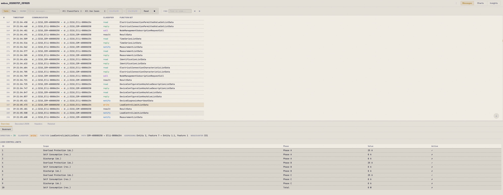
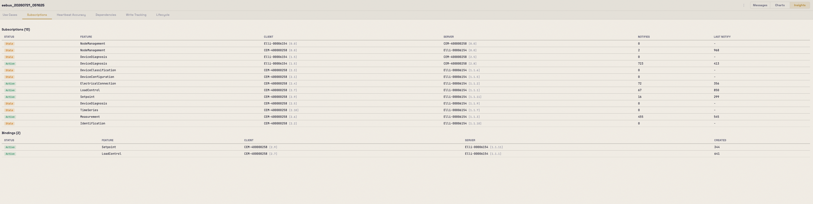

# EEBusTracer

**Open-source protocol analyzer for [EEBus](https://www.eebus.org/) (SHIP + SPINE).**
Capture, decode, correlate, and visualize the EEBus traffic exchanged between
EVSEs, EVs, home energy management systems, heat pumps, and other smart-grid
devices.

[](LICENSE)
[](go.mod)
[](#requirements)
[](#requirements)

---

## Screenshots

<p align="center">
  <br>
  <em>Message trace with SHIP/SPINE decoding, correlation, and a live capture progressing in real time.</em>
</p>

<p align="center">
  <br>
  <em>Device discovery: entity and feature trees per device with supported use cases.</em>
</p>

<p align="center">
  <br>
  <em>Time-series charts for measurements, load-control limits, and setpoints
  &mdash; with active-state awareness (dashed lines when inactive).</em>
</p>

<p align="center">
  <br>
  <em>Insights dashboard: use case detection, subscription/binding tracker,
  heartbeat accuracy, and lifecycle checklist.</em>
</p>

---

## Why EEBusTracer?

Debugging EEBus is painful. Wireshark has no SHIP or SPINE dissectors, EEBUS
Tester and EEBUS Hub are proprietary and subscription-only, and every device
vendor ships their own internal trace format (DLT, CEasierLogger, custom text
logs, etc.). Meanwhile the wire protocol is verbose JSON wrapped in SHIP
frames wrapped in a WebSocket &mdash; hand-reading it doesn't scale.

**EEBusTracer** is a free, developer-friendly, self-hostable alternative that
speaks all of these formats natively, decodes them into typed SPINE
datagrams, and adds the correlation and analysis views that are missing from
generic log viewers:

- Not a device simulator &mdash; it observes.
- No PKI/cloud/account. Everything runs locally against a SQLite file.
- Single Go binary, no CGO, works on macOS/Linux/Windows.
- Web UI, CLI, and REST API on the same core.

Built for EV charging integrators, HEMS developers, and anyone who has ever
sighed at a 400-line `nodeManagementDetailedDiscoveryData` reply.

---

## Status

Actively developed. Latest release **v0.6.0**; recent unreleased work adds
DLT text + binary import, live DLT streaming with APID/CTID filtering, and
live truncation counters. See [CHANGELOG.md](CHANGELOG.md).

---

## Key features

### Capture & import

- **Live capture sources:** UDP (raw EEBus stack), TCP (CNetLogServer), log
  tail (eebus-go / eebustester / CEasierLogger), and **live DLT streaming**
  from `dlt-daemon` (port 3490) with APID/CTID filter and auto-reconnect.
- **File import (auto-detected by content):** `.eet` native trace format,
  eebus-go / eebustester / EEBus Hub log formats, **DLT plain-text exports**,
  and **binary `.dlt` files** with `DLT\x01` magic.
- **mDNS device discovery** for `_ship._tcp` services on the local network.
- **Drag-and-drop import** in the web UI; `.eet` export for sharing traces.
- Truncated-payload counter (DLT commonly cuts long JSON mid-value):
  those frames are dropped rather than stored as garbage, and the count is
  surfaced live in the trace header.

### Protocol decoding

- SHIP and SPINE layers decoded via the enbility
  [`spine-go`](https://github.com/enbility/spine-go) and
  [`ship-go`](https://github.com/enbility/ship-go) modules &mdash; **all
  ~110 function set types**.
- SHIP message type overviews for `connectionHello`, `handshake`,
  `pinState`, `accessMethods`, `connectionClose`, `init`.
- SPINE datagram fields extracted for filtering: `cmdClassifier`, function
  set, entity/feature addresses, `msgCounter` / `msgCounterReference`.
- Vendor-friendly rendering of `deviceConfigurationKeyValue*` (human-readable
  key names + typed values).

### Search, filter, correlate

- Full-text search across payloads (SQLite FTS5) with boolean operators
  (`OR`, `AND`, `NOT`).
- Filter by time range, device address, entity, feature, function set,
  classifier, direction, SHIP message type.
- **Use-case-context filter** &mdash; e.g. show only messages that belong to
  the LPC (Limitation of Power Consumption) flow.
- Save and recall named **filter presets**.
- Virtual-scroll message table: 100k+ messages render smoothly, only visible
  rows are painted.
- **Message correlation** by `msgCounter` / `msgCounterReference` with
  request/response pairing and latency.
- **Orphaned request detection** with warning banner.

### Views

- **Table view** &mdash; classic message list with classifier color-coding,
  bookmarks, and inline correlation dots.
- **Flow view** &mdash; sequence diagram with device lifelines, arrows
  colored by classifier, dashed return lines for correlated pairs, and a
  swimlane overview bar with a message-density heatmap.
- **Charts** &mdash; measurement/load-control/setpoint time-series with
  active-state awareness, CSV export, and a custom-chart builder that
  auto-discovers chartable SPINE data sources.

### Insights (protocol intelligence)

- **Use case detection** from `nodeManagementUseCaseData` (36+ use cases
  including DBEVC, LPC, LPP, OSCEV, EVCC, OPEV, MPC, etc.).
- **Lifecycle checklist** &mdash; 5-step setup verification per (device, use
  case): SHIP handshake &rarr; feature discovery &rarr; UC announced
  &rarr; subscriptions &rarr; bindings. Failures list *specific* missing
  items so you can jump straight to the fix.
- **Dependency tree** &mdash; entity/feature trees per device with use case
  pills and subscription/binding edges.
- **Write tracking** &mdash; LoadControl and Setpoint write history with
  result correlation, latency, duration, and effective-state cards.
- **Subscription/binding tracker** with staleness detection.
- **Heartbeat accuracy** &mdash; jitter statistics per device pair
  (mean/stddev/min/max), CSV/JSON export.

### UI & platform

- Web UI with two themes: **Oscillograph** (dark, amber/gold, CRT-ish grain)
  and **Blueprint** (light, warm cream/navy).
- Self-hosted Space Grotesk + JetBrains Mono variable fonts &mdash; no CDN.
- Keyboard-driven navigation: `j`/`k` next/prev, `Ctrl+F` find, `Ctrl+G`
  jump-to-message, `Ctrl+L` focus filter, `?` for the full list.
- SQLite storage with WAL mode; a single file you can move between machines.
- Single static binary; no CGO; runs identically on macOS, Linux, Windows.

---

## Quick start

Bring the web UI up against a local `dlt-daemon` (default port 3490), the
most common workflow for wallboxes and HEMS gateways:

```bash
git clone https://github.com/<org>/eebustracer.git
cd eebustracer
go build -o eebustracer ./cmd/eebustracer

./eebustracer serve --port 8080
# open http://localhost:8080
# in the top bar, pick "DLT", enter host+port, optionally a filter like
# CEM or HEEB, and click Start Capture.
```

Or import a trace file you already have:

```bash
./eebustracer import /path/to/capture.dlt         # binary DLT
./eebustracer import /path/to/dltviewer-export.log # DLT text export
./eebustracer import /path/to/trace.eet            # native format
./eebustracer import /path/to/eebustester.log      # eebustester log
```

---

## Requirements

- **Go 1.22+** to build from source.
- Runtime: nothing else &mdash; the resulting binary embeds the web UI, the
  SQLite driver ([`modernc.org/sqlite`](https://pkg.go.dev/modernc.org/sqlite),
  pure Go), and all templates.

---

## Building

```bash
git clone https://github.com/<org>/eebustracer.git
cd eebustracer
go build ./cmd/eebustracer
```

Or use the Makefile:

```bash
make build        # Build binary for the host OS
make test         # Run tests
make test-race    # Run tests with race detector
make lint         # Run linter (golangci-lint)
```

### Cross-compiling for other platforms

Because the whole project is pure Go (no CGO), you can build binaries for
any target from any host — no cross-toolchain required. Output goes into
`build/dist/`.

```bash
make dist                # Linux amd64 + Windows amd64 (common desktop targets)
make dist-all            # All 6 targets: Linux/Windows/macOS × amd64/arm64

# Or target individually
make dist-linux          # Linux amd64
make dist-linux-arm64    # Linux arm64 (Raspberry Pi 4/5, ARM servers)
make dist-windows        # Windows amd64
make dist-windows-arm64  # Windows arm64
make dist-macos          # macOS Intel
make dist-macos-arm64    # macOS Apple Silicon
```

Binaries are stripped (`-s -w`) and stamped with the current git tag via
`-ldflags -X main.Version=...`. Set `VERSION=x.y.z` to override:

```bash
VERSION=1.0.0 make dist-linux
```

Without the Makefile, one-liners work fine:

```bash
GOOS=linux   GOARCH=amd64 go build -o eebustracer-linux-amd64      ./cmd/eebustracer
GOOS=windows GOARCH=amd64 go build -o eebustracer-windows-amd64.exe ./cmd/eebustracer
```

---

## Usage

### Web UI

```bash
./eebustracer serve --port 8080
```

Open http://localhost:8080. The top bar contains the capture controls:
select a source (UDP / TCP / Log Tail / **DLT**), enter the target, and
click **Start Capture**. Live messages appear via WebSocket without a page
reload. Multiple traces coexist in the sidebar.

### Headless capture

```bash
# UDP capture from an EEBus stack, Ctrl+C to stop
./eebustracer capture --target 192.168.1.100:4712

# Capture and export to file
./eebustracer capture --target 192.168.1.100:4712 -o trace.eet

# Tail an eebus-go log file
./eebustracer capture --log-file /var/log/eebus.log
```

### mDNS discovery

```bash
./eebustracer discover                     # 10 s scan
./eebustracer discover --timeout 30s --json
```

### Import / export

```bash
./eebustracer import trace.eet             # .eet native
./eebustracer import capture.dlt           # binary DLT
./eebustracer import export.log            # any supported log format

# Export a trace as .eet
curl http://localhost:8080/api/traces/1/export > trace.eet
```

Import auto-detects the file format by content (magic bytes for `.dlt`,
prefix regex for text formats), so extension doesn't matter.

### Protocol analysis

```bash
./eebustracer analyze trace.eet --check all
./eebustracer analyze trace.eet --check metrics --output json
./eebustracer analyze trace.eet --check usecases,metrics
```

### Global options

```bash
./eebustracer --db /path/to/traces.db serve   # default: ~/.eebustracer/traces.db
./eebustracer -v serve                        # verbose/debug logs
```

### Other commands

```bash
./eebustracer version
./eebustracer --help
```

---

## Keyboard shortcuts

Press `?` inside the web UI for the full list. Highlights:

| Key | Action |
|-----|--------|
| `j` / `k` | Next / previous message |
| `Ctrl+F` | Find in view |
| `Ctrl+G` | Jump to sequence or message counter |
| `Ctrl+L` | Focus the filter input |
| `[` / `]` | Previous / next bookmark |
| `?` | Show all shortcuts |

---

## REST API

Everything the web UI does is available as JSON over HTTP. Highlights:

| Method | Endpoint | Description |
|--------|----------|-------------|
| GET | `/api/traces` | List all traces |
| POST | `/api/traces` | Create a new trace |
| GET | `/api/traces/{id}` | Get trace by ID |
| PATCH | `/api/traces/{id}` | Rename trace |
| DELETE | `/api/traces/{id}` | Delete trace |
| GET | `/api/traces/{id}/messages` | List messages (paginated, filterable, searchable) |
| GET | `/api/traces/{id}/messages/summaries` | All message summaries (for virtual scroll) |
| GET | `/api/traces/{id}/messages/{mid}` | Get single message with full payload |
| GET | `/api/traces/{id}/messages/{mid}/related` | Correlated messages |
| GET | `/api/traces/{id}/messages/{mid}/conversation` | Conversation grouping by device pair + function set |
| GET | `/api/traces/{id}/orphaned-requests` | Requests with no response |
| GET | `/api/traces/{id}/usecase-context` | Use case context for filtering |
| GET | `/api/traces/{id}/devices` | Devices with entity/feature tree |
| GET | `/api/traces/{id}/connections` | Connection state timeline |
| GET | `/api/traces/{id}/timeseries` | Measurement/load-control/setpoint time series |
| GET | `/api/traces/{id}/timeseries/discover` | Discover chartable data sources |
| GET | `/api/traces/{id}/charts` | List chart definitions |
| GET | `/api/traces/{id}/usecases` | Detected use cases per device |
| GET | `/api/traces/{id}/subscriptions` | Subscription tracker |
| GET | `/api/traces/{id}/bindings` | Binding tracker |
| GET | `/api/traces/{id}/metrics` | Heartbeat accuracy metrics |
| GET | `/api/traces/{id}/depgraph` | Dependency tree |
| GET | `/api/traces/{id}/writetracking` | LoadControl/Setpoint write history |
| GET | `/api/traces/{id}/lifecycle` | Use case lifecycle checklist |
| GET | `/api/capture/status` | Capture engine status (including live truncated count) |
| POST | `/api/capture/start` | Start UDP capture |
| POST | `/api/capture/start/tcp` | Start TCP capture |
| POST | `/api/capture/start/logtail` | Start log tail capture |
| POST | `/api/capture/start/dlt` | Start live DLT capture (`host`, `port`, `filter`, `name`) |
| POST | `/api/capture/stop` | Stop capture |
| GET | `/api/mdns/devices` | mDNS-discovered devices |
| POST | `/api/traces/import` | Import `.eet` / `.log` / `.dlt` file |
| GET | `/api/traces/{id}/export` | Export trace as `.eet` |
| GET | `/api/traces/{id}/live` | WebSocket live message stream |

The `/messages` and `/messages/summaries` endpoints accept these query
parameters: `search`, `cmdClassifier`, `functionSet`, `shipMsgType`,
`direction`, `device`, `deviceSource`, `deviceDest`, `entitySource`,
`entityDest`, `featureSource`, `featureDest`, `timeFrom`, `timeTo`, `limit`,
`offset`.

---

## Documentation

- [ROADMAP.md](ROADMAP.md) &mdash; features shipped and planned
- [CHANGELOG.md](CHANGELOG.md) &mdash; version history
- [docs/ARCHITECTURE.md](docs/ARCHITECTURE.md) &mdash; system architecture
- [docs/INTEGRATION.md](docs/INTEGRATION.md) &mdash; integrator guide
- [docs/OVERVIEW_RENDERERS.md](docs/OVERVIEW_RENDERERS.md) &mdash; adding Overview-tab decoders

---

## Contributing

Issues, feature requests, and pull requests welcome. Please run `make test`
and `make lint` before submitting. The project follows strict TDD (see
`CLAUDE.md`) &mdash; new features should ship with tests.

---

## License

MIT &mdash; see [LICENSE](LICENSE).

---

## Keywords

*EEBus, SPINE, SHIP, EEBUS Tester alternative, EEBUS Hub alternative,
protocol analyzer, EV charging, EVSE, wallbox debugging, HEMS, home energy
management, smart grid, DLT, DLT Viewer, dlt-daemon, LPC, LPP, DBEVC,
`nodeManagementDetailedDiscoveryData`, mDNS `_ship._tcp`, Wireshark
alternative for EEBus, go, self-hosted.*
