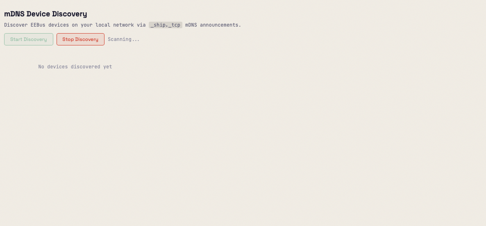
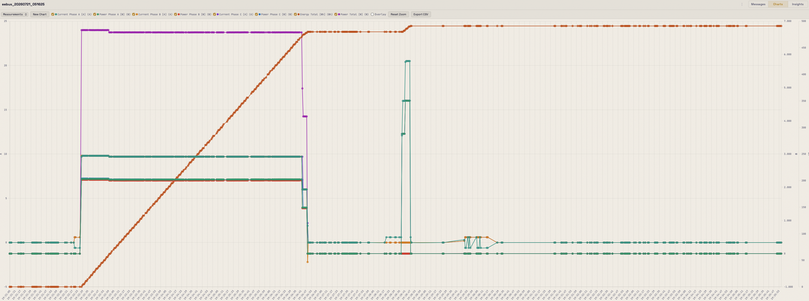

# EEBusTracer

A cross-platform trace recording and analysis tool for the
[EEBus](https://www.eebus.org/) protocol stack (SHIP + SPINE).

## Status

**v0.6.0 released** — see [CHANGELOG.md](CHANGELOG.md) for details.

## What is EEBusTracer?

EEBusTracer captures, decodes, and visualizes EEBus protocol communication.
It helps developers and integrators debug, analyze, and validate EEBus device
interactions.

**Key features:**

*Capture & Import*
- Three capture modes: UDP, TCP (CNetLogServer), and live log tail
- Import log files from eebus-go, eebustester, CEasierLogger, and EEBus Hub
  with auto-detection
- mDNS device discovery: browse `_ship._tcp` services to find EEBus devices
- Drag-and-drop `.eet`/`.log` file import; import/export traces in `.eet` format

*Protocol Decoding*
- Decode SHIP and SPINE protocol layers using the enbility eebus-go ecosystem
- Identify SHIP message types (connectionHello, data, accessMethods, etc.)
- Extract SPINE datagram fields: cmdClassifier, function set, addresses, msgCounter
- DeviceConfiguration decoding with human-readable key names and typed values
- Entity/feature addressing shown in message detail overview

*Search & Filtering*
- Full-text search with boolean operators (OR, AND, NOT) via SQLite FTS5
- Filter by time range, device, entity, feature, function set, classifier,
  direction; time range inputs in toolbar
- Use-case-context filtering (e.g. show only LPC-related messages)
- Save and recall named filter presets
- Virtual scroll message table: loads all messages, renders only visible rows

*Analysis & Correlation*
- Message correlation: match request/response pairs by msgCounter with latency
- Orphaned request detection (requests with no response)
- Device discovery view with entity/feature trees
- Connection state timeline with anomaly detection
- Bookmarks and annotations with custom labels and colors

*Charts*
- Measurement, load control, and setpoint charts with CSV export
- Active state awareness: dashed lines for inactive values, ON/OFF annotations
- Custom chart builder with auto-discovery of chartable SPINE data sources
- Multi-y-axis support for mixed units

*Protocol Intelligence (Insights page)*
- Use case detection from `nodeManagementUseCaseData` (36+ use cases incl. DBEVC)
- Dependency tree: per-device entity/feature trees with use case and edge annotations
- Use case lifecycle checklist: 5-step setup verification per device (SHIP
  handshake, feature discovery, UC announced, subscriptions, bindings)
- Write tracking: LoadControl/Setpoint write history with result correlation,
  latency, duration, and effective state view
- Subscription and binding lifecycle tracking with staleness detection
- Heartbeat accuracy metrics (jitter statistics per device pair)

*UI & Platform*
- Web-based UI with dark "Oscillograph" and light "Blueprint" themes
- About page with version, dependency, and system information
- SQLite persistence with WAL mode for concurrent access
- Cross-platform: macOS, Linux, Windows — single binary, no CGO

## Screenshots

<!-- Replace these placeholders with actual screenshots of your app -->

<p align="center">
  <br>
  <em>Message trace view with protocol decoding and correlation highlighting</em>
</p>

<p align="center">
  <br>
  <em>Device discovery with entity/feature tree</em>
</p>

<p align="center">
  <br>
  <em>Measurement and load control charts</em>
</p>

<p align="center">
  <br>
  <em>Protocol intelligence dashboard with use case detection and heartbeat metrics</em>
</p>

## Requirements

- Go 1.22 or later

## Building from Source

```bash
git clone https://github.com/<org>/eebustracer.git
cd eebustracer
go build ./cmd/eebustracer
```

Or use the Makefile:

```bash
make build        # Build binary
make test         # Run tests
make test-race    # Run tests with race detector
make lint         # Run linter
```

## Usage

### Web UI

```bash
# Start the web UI on port 8080
./eebustracer serve --port 8080
```

Then open http://localhost:8080 in your browser. Enter the EEBus stack's IP
address and port in the top bar, then click "Start Capture". The tracer connects
to the EEBus stack via UDP, and SHIP frames appear in real time via WebSocket.

### Headless Capture

```bash
# Connect to EEBus stack and capture, press Ctrl+C to stop
./eebustracer capture --target 192.168.1.100:4712

# Capture and export to file
./eebustracer capture --target 192.168.1.100:4712 -o trace.eet

# Tail an eebus-go log file
./eebustracer capture --log-file /var/log/eebus.log
```

### mDNS Discovery

```bash
# Discover EEBus devices on the network (10s scan)
./eebustracer discover

# Longer scan with JSON output
./eebustracer discover --timeout 30s --json
```

### Import/Export

```bash
# Import a .eet trace file
./eebustracer import trace.eet

# Export via the web UI or REST API
curl http://localhost:8080/api/traces/1/export > trace.eet
```

### Protocol Analysis

```bash
# Run all analysis checks on a trace file
./eebustracer analyze trace.eet --check all

# Run heartbeat metrics only, JSON output
./eebustracer analyze trace.eet --check metrics --output json

# Run specific checks
./eebustracer analyze trace.eet --check usecases,metrics
```

### Global Options

```bash
# Use a custom database location (default: ~/.eebustracer/traces.db)
./eebustracer --db /path/to/my/traces.db serve

# Enable verbose/debug output
./eebustracer -v serve
```

### Other Commands

```bash
./eebustracer version      # Print version
./eebustracer --help       # Show help
```

## REST API

| Method | Endpoint | Description |
|--------|----------|-------------|
| GET | `/api/traces` | List all traces |
| POST | `/api/traces` | Create a new trace |
| GET | `/api/traces/{id}` | Get trace by ID |
| PATCH | `/api/traces/{id}` | Rename trace |
| DELETE | `/api/traces/{id}` | Delete trace |
| GET | `/api/traces/{id}/messages` | List messages (paginated, filterable, searchable) |
| GET | `/api/traces/{id}/messages/summaries` | All message summaries (virtual scroll) |
| GET | `/api/traces/{id}/messages/{mid}` | Get single message |
| GET | `/api/traces/{id}/messages/{mid}/related` | Get correlated messages |
| GET | `/api/traces/{id}/messages/{mid}/conversation` | Conversation grouping by device pair + function set |
| GET | `/api/traces/{id}/orphaned-requests` | Requests with no response |
| GET | `/api/traces/{id}/usecase-context` | Use case context for filtering |
| GET | `/api/traces/{id}/devices` | List devices with entity/feature tree |
| GET | `/api/traces/{id}/devices/{did}` | Get device detail |
| GET | `/api/traces/{id}/connections` | Connection state timeline |
| GET | `/api/traces/{id}/descriptions` | Description context (phase, scope labels) |
| GET | `/api/traces/{id}/timeseries` | Measurement/load control time series |
| GET | `/api/traces/{id}/timeseries/discover` | Discover chartable data sources |
| GET | `/api/traces/{id}/charts` | List chart definitions |
| POST | `/api/traces/{id}/charts` | Create chart definition |
| GET | `/api/charts/{id}` | Get chart definition |
| PATCH | `/api/charts/{id}` | Update chart definition |
| DELETE | `/api/charts/{id}` | Delete chart definition |
| GET | `/api/traces/{id}/charts/{cid}/data` | Render chart data |
| GET | `/api/traces/{id}/usecases` | Detected use cases per device |
| GET | `/api/traces/{id}/subscriptions` | Subscription tracker |
| GET | `/api/traces/{id}/bindings` | Binding tracker |
| GET | `/api/traces/{id}/metrics` | Heartbeat accuracy metrics |
| GET | `/api/traces/{id}/metrics/export` | Export heartbeat metrics as CSV/JSON |
| GET | `/api/traces/{id}/depgraph` | Dependency tree (devices, features, use cases, edges) |
| GET | `/api/traces/{id}/writetracking` | Write tracking (LoadControl/Setpoint writes) |
| GET | `/api/traces/{id}/lifecycle` | Use case lifecycle checklist |
| GET | `/api/traces/{id}/bookmarks` | List bookmarks |
| POST | `/api/traces/{id}/bookmarks` | Create bookmark |
| DELETE | `/api/bookmarks/{id}` | Delete bookmark |
| GET | `/api/presets` | List filter presets |
| POST | `/api/presets` | Save filter preset |
| DELETE | `/api/presets/{id}` | Delete filter preset |
| GET | `/api/capture/status` | Capture engine status |
| POST | `/api/capture/start` | Start UDP capture |
| POST | `/api/capture/start/logtail` | Start log tail capture |
| POST | `/api/capture/start/tcp` | Start TCP capture (CNetLogServer) |
| POST | `/api/capture/stop` | Stop capture |
| GET | `/api/mdns/devices` | List mDNS-discovered devices |
| GET | `/api/mdns/status` | mDNS monitor status |
| POST | `/api/mdns/start` | Start mDNS discovery |
| POST | `/api/mdns/stop` | Stop mDNS discovery |
| POST | `/api/traces/import` | Import .eet/.log file |
| GET | `/api/traces/{id}/export` | Export trace as .eet |
| GET | `/api/traces/{id}/live` | WebSocket live stream |

### Message Filter Parameters

The `/api/traces/{id}/messages` and `/api/traces/{id}/messages/summaries`
endpoints support these query parameters:

| Parameter | Description |
|-----------|-------------|
| `search` | Full-text search across message content |
| `cmdClassifier` | Filter by command classifier (read, reply, write, call, notify) |
| `functionSet` | Filter by function set name |
| `shipMsgType` | Filter by SHIP message type |
| `direction` | Filter by direction (incoming, outgoing) |
| `device` | Filter by device address (matches source OR destination) |
| `deviceSource` | Filter by source device address |
| `deviceDest` | Filter by destination device address |
| `entitySource` | Filter by source entity address |
| `entityDest` | Filter by destination entity address |
| `featureSource` | Filter by source feature address |
| `featureDest` | Filter by destination feature address |
| `timeFrom` | Filter messages after this timestamp (RFC3339) |
| `timeTo` | Filter messages before this timestamp (RFC3339) |
| `limit` | Page size (default: 100) |
| `offset` | Pagination offset |

## Documentation

- [ROADMAP.md](ROADMAP.md) — Feature roadmap and milestones
- [CHANGELOG.md](CHANGELOG.md) — Version history
- [docs/ARCHITECTURE.md](docs/ARCHITECTURE.md) — System architecture
- [docs/INTEGRATION.md](docs/INTEGRATION.md) — Integration guide
- [docs/OVERVIEW_RENDERERS.md](docs/OVERVIEW_RENDERERS.md) — Adding Overview tab decoders

## License

MIT — see [LICENSE](LICENSE) for details.
