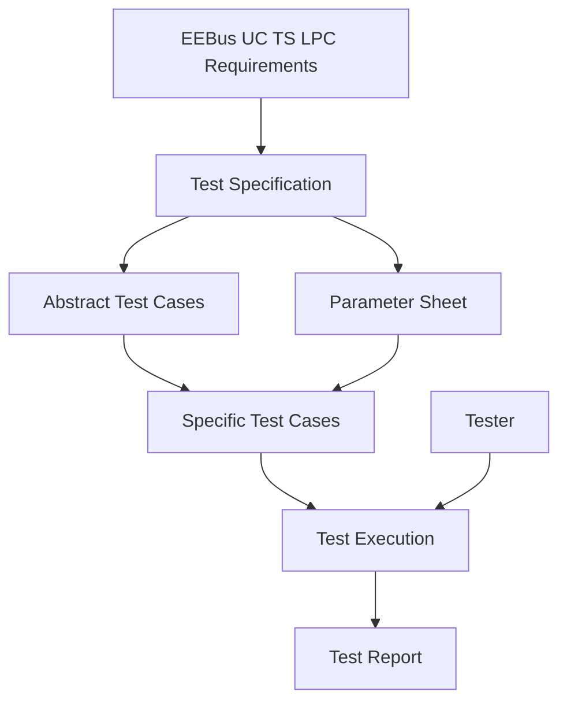
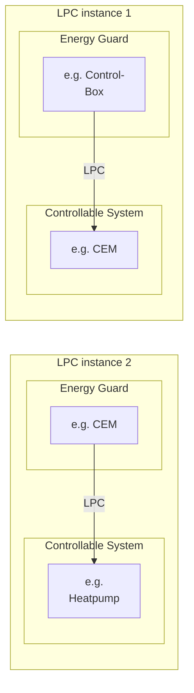

# EEBus High-Level Test Specification

## Limitation of Power Consumption

Version 1.0.0

Cologne, 2024-04-30

EEBus Initiative e.V.
Deutz-Mülheimer-Straße 183
51063 Cologne
GERMANY

Rue d'Arlon 25
1050 Brussels
BELGIUM

Phone: +49 221 / 715 938 - 0
Fax: +49 221 / 715 938 - 99

info@eebus.org
www.eebus.org

District court: Cologne
VR 17275

---

## Terms of use for publications of EEBus Initiative e.V.

### General information
The specifications, particulars, documents, publications and other information provided by the EEBus Initiative e.V. are solely for general informational purposes. Particularly specifications that have not been submitted to national or international standardisation organisations by EEBus Initiative e.V. (such as DKE/DIN-VDE or IEC/CENELEC/ETSI) are versions that have not yet undergone complete testing and can therefore only be considered as preliminary information. Even versions that have already been published via standardisation organisations can contain errors and will undergo further improvements and updates in future.

### Liability
EEBus Initiative e.V. does not assume liability or provide a guarantee for the accuracy, completeness or up-to-date status of any specifications, data, documents, publications or other information provided and particularly for the functionality of any developments based on the above.

### Copyright, rights of use and exploitation
The specifications provided are protected by copyright. Parts of the specifications have been submitted to national or international standardisation organisations by EEBus Initiative e.V., such as DKE/DIN-VDE or IEC/CENELEC/ETSI, etc. Furthermore, all rights to use and/or exploit the specifications belong to the EEBus Initiative e.V., Deutz-Mülheimer-Straße 183, 51063 Cologne, Germany and can be used in accordance with the following regulations:

The use of the specifications for informational purposes is allowed. It is therefore permitted to use information evident from the contents of the specifications. In particular, the user is permitted to offer products, developments and/or services based on the specifications.

Any respective use relating to standardisation measures by the user or third parties is prohibited. In fact, the specifications may only be used by EEBus Initiative e.V. for standardisation purposes. The same applies to their use within the framework of alliances and/or cooperations that pursue the aim of determining uniform standards.

Any use not in accordance with the purpose intended by EEBus Initiative e.V. is also prohibited.

Furthermore, it is prohibited to edit, change or falsify the content of the specifications. The dissemination of the specifications in a changed, revised or falsified form is also prohibited. The same applies to the publication of extracts if they distort the literal meaning of the specifications as a whole.

It is prohibited to pass on the specifications to third parties without reference to these rights of use and exploitation.

It is also prohibited to pass on the specifications to third parties without informing them of the authorship or source.

Without the prior consent of EEBus Initiative e.V., all forms of use and exploitation not explicitly stated above are prohibited.

Copyright © 2024 EEBus Initiative e.V. All rights reserved.

---

## 1 Table of contents

- Table of contents
- List of figures
- List of tables
- 1 Introduction
  - 1.1 Motivation
  - 1.2 Structure
  - 1.3 Limitations
  - 1.4 Contact information
- 2 Scope
  - 2.1 Overview
- 3 References
  - 3.1 EEBUS documents
  - 3.2 Normative references
- 4 Terms, definitions and abbreviations
  - 4.1 Terms and definitions
    - 4.1.1 Abstract Test Case
    - 4.1.2 Black Box Testing
    - 4.1.3 Device Under Test (DUT)
    - 4.1.4 Expected result
    - 4.1.5 LPC Instances
    - 4.1.6 MAY
    - 4.1.7 Negative testing
    - 4.1.8 Positive testing
    - 4.1.9 Pre-condition
    - 4.1.10 SHALL
    - 4.1.11 SHOULD
    - 4.1.12 Specific Test Case
    - 4.1.13 Test suite
    - 4.1.14 Verdict
  - 4.2 Abbreviations
- 5 Requirements
  - 5.1 Mapping of requirements
  - 5.2 Requirements and definitions extracted from [LPC1.0.0]
- 6 Test suite conventions
  - 6.1 General information
  - 6.2 Conceptual test process
    - 6.2.1 Test specification
    - 6.2.2 Specific test cases
    - 6.2.3 Test execution
    - 6.2.4 Test report
  - 6.3 Test suite identifiers
    - 6.3.1 Abstract test case identifier
    - 6.3.2 Test configuration identifier
    - 6.3.3 Timeout identifier
  - 6.4 Abstract test case description
    - 6.4.1 Abstract test case example
  - 6.5 Test configurations
    - 6.5.1 Behaviour of the DUT
    - 6.5.2 Behaviour of the tester
    - 6.5.3 Energy Guard
    - 6.5.4 Controllable System
  - 6.6 Timeouts and timings
  - 6.7 Test case execution
  - 6.8 Test case variation
  - 6.9 LPC instances
  - 6.10 Test verdict
  - 6.11 Data sets
    - 6.11.1 Message handling
    - 6.11.2 Active Power Consumption Limit
    - 6.11.3 Active Power Consumption Limit duration
    - 6.11.4 Active Power Consumption Limit message combinations
    - 6.11.5 Failsafe Consumption Active Power Limit
    - 6.11.6 Pre-Configured Failsafe Consumption Active Power Limit
    - 6.11.7 Failsafe Duration Minimum
    - 6.11.8 Startup duration
  - 6.12 Requirement coverage
  - 6.13 Test case coverage
- 7 Abstract test cases for EG
  - 7.1 General information
  - 7.2 Common abstract test cases
    - 7.2.1 Heartbeat
    - 7.2.2 Connection
    - 7.2.3 Messages
- 8 Abstract test cases for CS
  - 8.1 General information
  - 8.2 Common abstract test cases
    - 8.2.1 Heartbeat
    - 8.2.2 Connection
    - 8.2.3 Init
    - 8.2.4 Limited
    - 8.2.5 Unlimited/controlled
    - 8.2.6 Failsafe state
    - 8.2.7 Unlimited/autonomous
    - 8.2.8 Transition 1
    - 8.2.9 Transition 2
    - 8.2.10 Transition 3
    - 8.2.11 Transition 4
    - 8.2.12 Transition 5
    - 8.2.13 Transition 6
    - 8.2.14 Transition 7
    - 8.2.15 Transition 8
    - 8.2.16 Transition 9
    - 8.2.17 Transition 10
    - 8.2.18 Transition 11
    - 8.2.19 Transition 12
  - 8.3 LPC instance 1 (CS located on a CEM) abstract test cases
  - 8.4 LPC instance 2 (CS not located on a CEM) abstract test cases

## List of figures

- Figure 1: Conceptual test process
- Figure 2: Example for two instances of LPC Use Case

## List of tables

- Table 1: Abbreviations
- Table 2: Naming convention for abstract test case names
- Table 3: Naming convention for abstract test case identifiers
- Table 4: Naming convention for test configurations
- Table 5: Naming convention for timeouts
- Table 6: Abstract test case description template
- Table 7: Abstract test case example
- Table 8: EG test configurations
- Table 9: CS test configurations
- Table 10: Test verdicts
- Table 11: Active Power Consumption Limit configurations
- Table 12: Requirement coverage
- Table 13: Test case coverage of verdict statements
- Table 14: ATC_COM_PT_EGHeartbeat_001
- Table 15: ATC_COM_PT_EGConnection_001
- Table 16: ATC_COM_PT_EGConnection_002
- Table 17: ATC_COM_PT_EGConnection_003
- Table 18: ATC_COM_PT_EGMessages_001
- Table 19: ATC_COM_PT_EGMessages_002
- Table 20: ATC_COM_PT_EGMessages_003
- Table 21: ATC_COM_PT_EGMessages_004
- Table 22: ATC_COM_PT_CSHeartbeat_001
- Table 23: ATC_COM_NT_CSConnection_001
- Table 24: ATC_COM_PT_CSConnection_002
- Table 25: ATC_COM_PT_CSConnection_003
- Table 26: ATC_COM_PT_CSConnection_004
- Table 27: ATC_COM_PT_CSConnection_005
- Table 28: ATC_COM_PT_CSConnection_006
- Table 29: ATC_COM_PT_CSConnection_007
- Table 30: ATC_COM_PT_CSConnection_008
- Table 31: ATC_COM_PT_CSConnection_009
- Table 32: ATC_COM_PT_CSInit_001
- Table 33: ATC_COM_PT_CSInit_002
- Table 34: ATC_COM_PT_CSInit_003
- Table 35: ATC_COM_NT_CSLimited_001
- Table 36: ATC_COM_PT_CSLimited_002
- Table 37: ATC_COM_NT_CSUnlCntrl_001
- Table 38: ATC_COM_PT_CSUnlCntrl_002
- Table 39: ATC_COM_PT_CSUnlCntrl_003
- Table 40: ATC_COM_PT_CSFS_001
- Table 41: ATC_COM_PT_CSFS_002
- Table 42: ATC_COM_PT_CSFS_003
- Table 43: ATC_COM_NT_CSUnlAuto_001
- Table 44: ATC_COM_PT_CSUnlAuto_002
- Table 45: ATC_COM_PT_CSTransition1_001
- Table 46: ATC_COM_PT_CSTransition1_002
- Table 47: ATC_COM_PT_CSTransition2_001
- Table 48: ATC_COM_PT_CSTransition3_001
- Table 49: ATC_COM_PT_CSTransition3_002
- Table 50: ATC_COM_PT_CSTransition4_001
- Table 51: ATC_COM_PT_CSTransition5_001
- Table 52: ATC_COM_PT_CSTransition6_001
- Table 53: ATC_COM_PT_CSTransition6_002
- Table 54: ATC_COM_PT_CSTransition7_001
- Table 55: ATC_COM_PT_CSTransition8_001
- Table 56: ATC_COM_PT_CSTransition8_002
- Table 57: ATC_COM_PT_CSTransition9_001
- Table 58: ATC_COM_PT_CSTransition10_001
- Table 59: ATC_COM_PT_CSTransition10_002
- Table 60: ATC_COM_PT_CSTransition11_001
- Table 61: ATC_COM_PT_CSTransition11_002
- Table 62: ATC_COM_PT_CSTransition12_001
- Table 63: ATC_INS1_PT_CSTransition1_001
- Table 64: ATC_INS2_PT_CSTransition1_001

## 1 Introduction

### 1.1 Motivation
The objective of this document is to provide a basis for interoperability and comparable quality assurance for EEBus member companies and organizations regarding the various components used to meet the high-level requirements described in [LPC1.0.0].

Due to independent implementations of different vendors which lead to a high degree of complexity, the avoidance of implementation and interpretation errors is the goal for an interoperable system. Therefore, the technical specification for Limitation of Power Consumption defines a generic homogenous and harmonized technology-independent implementations. To verify the desired interoperable behaviour between various applications, hardware and software components, the test specification is necessary.

This test specification defines a test suite of abstract test cases being relevant in order to ensure defined behaviour and to derive an agreed and common set of specific conformance tests.

The conformance tests described in this document are generic to apply to different implementations and therefore increase their ability of interoperability. Implementers should gain confidence that each implementation conforms the test specification.

### 1.2 Structure
Following objectives are identified in the scope of the test specification document:

- Specification of abstract test cases in agreement with the respective requirements
- Defined set of abstract test cases
- Standardised procedures within the abstract test cases
- Forming basic internals (due to black box testing) of each test in a defined test description

### 1.3 Limitations
Considering that it is impossible to define an exhaustive test suite due to independent implementations within different hardware approaches, these tests do not include the assessment of performance nor robustness or reliability of an implementation. The test specification itself cannot guarantee conformity to the technical specification since it detects errors rather than their absence. Hence, no guarantee of interoperability is given if the implementation is only conforming the test specification. It also focuses on the correct behavior rather than the verification of messages generated by a device under test (DUT). Due to this limitation, only limited tests are defined in this test specification to verify that a DUT message complies with the limits defined in [LPC1.0.0].

In addition, no measurement requirements are specified for checking the Active Power Consumption Limit and Failsafe Consumption Power Limit to be maintained during test executions. A test engineer may still use appropriate measuring equipment to verify conformance to these limits.

### 1.4 Contact information
Questions regarding the conformance process that are not addressed by this document should be directed to: info@eebus.org.

## 2 Scope

The purpose of the EEBus test specification for the technical specification of the Use Case "Limitation of Power Consumption" (short name: LPC) is to verify the conformance to section 2 of [LPC1.0.0].

This document focuses on defining a conformance test suite which is then used as a necessary requirement for interoperability tests when dealing with projects using the EEBus technical specification for the Use Case "Limitation of Power Consumption".

Furthermore, this document mainly refers to the testing of the Controllable System and only covers rudimentary functional testing of the Energy Guard.

### 2.1 Overview
This document contains scope, referenced documents, abstract test cases (such as conformance or scenario) and test procedures for a Device Under Test (DUT) implementing the LPC according to the following document which define the Limitation of Power Consumption and its underlying resources as defined in:

- EEBus_UC_TS_LimitationOfPowerConsumption_V1.0.0 ([LPC1.0.0])

It provides a detailed description of each test, including as applicable, identification number(s) (ID) and used configurations.

In chapter 3, referenced documents are provided.

A detailed terms and abbreviations description can be found in chapter 4.

Chapter 5 defines the requirements which serve as the foundation on which the abstract test cases are based on.

In chapter 6, a framework for the abstract test cases and their execution is described. The sections contain general information and descriptions as well as the data sets to be used.

The chapters 7 and 8 contain the high-level abstract test cases for both Energy Guard and Controllable System which describe the step-by-step actions, expected results and any special conditions necessary for testing.
Due to different approaches while using [LPC1.0.0] the abstract test cases are defined to be applicable for any specific implementation.

## 3 References

The following documents include essential guidelines and requirements which, through reference in this text, constitute guidelines and requirements of this document. In case of dated references, subsequent amendments to, or revisions of, any of these publications do not apply. Latest issue of undated references shall be used unless otherwise agreed.

### 3.1 EEBUS documents

[LPC1.0.0] EEBus_UC_TS_LimitationOfPowerConsumption_V1.0.0.pdf

[ParameterSheet] EEBus_LPC_ParameterSheet_V1.0.0.xlsx

### 3.2 Normative references

[RFC2119] IETF RFC 2119: 1997, Key words for use in RFCs to indicate requirement levels (please see section 4.1 for details)# 4 Terms, definitions and abbreviations

# 4 Terms, definitions and abbreviations

## 4.1 Terms and definitions

Within the scope of this document terms and definitions given in [LPC1.0.0] and the following apply.

As a source of common terminology for use in standardization please see the following databases of ISO, IEC and ISTQB:

- ISO Online Browsing Platform (OBP): https://www.iso.org/obp/ui
- IEC Electropedia: https://www.electropedia.org/
- ISTQB Glossary: https://glossary.istqb.org/en/search/

NOTE 1: Hyperlinks included in this document are subject to its validity at the time of publication, hence no guarantee can be given by the EEBus Initiative e.V. for its long-term validity.

### 4.1.1 Abstract Test Case

A test case without specific (implementation level) values for input data and expected results.

### 4.1.2 Black Box Testing

Black Box Testing is a software testing method in which the behaviour of a DUT is tested without having knowledge of internal code structure, implementation details and internal paths. This method mainly focuses on input and output of software applications.

### 4.1.3 Device Under Test (DUT)

A Device Under Test is a single component, an assembly or an appliance that is undergoing testing.

### 4.1.4 Expected result

The observable presumed behaviour of the DUT based on its test step.

### 4.1.5 LPC Instances

The LPC instances describe the possibility of implementing the Use Case in different constellations.

LPC instance 1: The power consumption limit is first sent from the EG (e.g., Control-Box) to the Customer Energy Manager (CEM). The CEM then tries to control its connected appliances to achieve this limit at the grid connection point.

LPC instance 2: The energy guard (located on a CEM) sends a dedicated power consumption limit to an appliance.

NOTE 2: For further information regarding the LPC instances please refer to section 6.9 and [LPC1.0.0] section 2.4.

### 4.1.6 MAY

Verbal form (as defined in [RFC2119]) used to indicate a course of action permissible and optional within the limits of the Use Case ([LPC1.0.0]).

### 4.1.7 Negative testing

Negative testing is a testing method which checks whether the application reacts as expected to an input or an operation that does not meet application requirements, e.g. by correctly rejecting invalid or improper data sets as an input.

NOTE 3: During test execution, values may be used (e.g. negative APCL values) that may violate the requirements defined in [LPC1.0.0].

### 4.1.8 Positive testing

Determines that the DUT works as expected by providing valid data sets as an input.

NOTE 4: This type of test behaviour is primarily defined in this document.

NOTE 5: During test execution, values may be used (e.g. negative APCL values) that may violate the requirements defined in [LPC1.0.0].

### 4.1.9 Pre-condition

The test steps needed to define a stable state of a test item and its environment prior to the test case execution.

### 4.1.10 SHALL

Verbal form (as defined in [RFC2119]) used to indicate requirements strictly to be followed in order to conform to the standard.

### 4.1.11 SHOULD
Verbal form (as defined in [RFC2119]) used to indicate that among several possibilities one is recommended as particularly suitable, or that a certain course of action is preferred but not necessarily required.

### 4.1.12 Specific Test Case

Within this document specific test cases are derived from abstract test cases by adding defined data sets.

### 4.1.13 Test suite

A set of test cases to be executed in a specific test run.

### 4.1.14 Verdict

Test verdicts are used to indicate the consequence/outcome of the execution of a test case. Possible outcome statements are "passed", "failed" or "not applicable" as defined in section 6.10.

## 4.2 Abbreviations

For the present document following abbreviations apply.

| Term/Abbreviation | Description |
|-------------------|-------------|
| ACK | Acknowledgement |
| APCL | Active Power Consumption Limit |
| ATC | Abstract Test Case |
| CEM | Customer Energy Manager |
| CS | Controllable System |
| DUT | Device Under Test |
| EG | Energy Guard |
| FCAPL | Failsafe Consumption Active Power Limit |
| LPC | Limitation of Power Consumption |
| MFSDM | Maximum Failsafe Duration Minimum |
| NACK | Negative Acknowledgement |
| NT | Negative Testing |
| PFCAPL | Pre-Configured Failsafe Consumption Active Power Limit |
| PFSDM | Pre-Configured Failsafe Duration Minimum |
| PT | Positive Testing |
| Ref No | Reference Number |
| STC | Specific Test Case |
| TC | Test Case |
| TestSpec | Test Specification |
| UC | Use Case |

*Table 1: Abbreviations*

# 5 Requirements

## 5.1 Mapping of requirements

Within this document, unique identifiers are used primarily for each mandatory requirement extracted from [LPC1.0.0] allowing full traceability and easier management. Related recommended or optional requirements are provided with a sub-requirement ID following design guidelines of [LPC1.0.0]. In addition, markers used in [LPC1.0.0] are provided as well as the corresponding sections to ensure a quick search in the Use Case.

The short form of the identifier is as follows:

    [LPC-TS-xxx/y]

Definition:

- "LPC" represents the use case abbreviation of the technical specification [LPC1.0.0];
- "TS" stands for Test Specification;
- "xxx" represents the unique number for the individual requirement; and
- "y" symbolizes a unique number and is only used for sub-requirements.

The notation of the Use Case references as well as an example is given below.

    Ref No: marker, section(s)

Example:

    Ref No: [LPC-022], 2.1, 2.2, 2.6.2.1 and 2.7.1

## 5.2 Requirements and definitions extracted from [LPC1.0.0]

[LPC-TS-001] The APCL SHALL always be greater than or equal to zero as defined in [LPC1.0.0], Ref No: [LPC-001], 2.8.1.

  [LPC-TS-001/1] A limit MAY have a duration that states the time the limit is valid for as defined in [LPC1.0.0], Ref No: [LPC-004], 2.6.1.1.

  [LPC-TS-001/2] The EG MAY activate or deactivate the limit as defined in [LPC1.0.0], Ref No: [LPC-008], 2.6.1.1.

[LPC-TS-002] The CS SHALL confirm an accepted APCL with an ACK as defined in [LPC1.0.0], Ref No: [LPC-002/1], 2.2 and 2.6.1.1.

[LPC-TS-003] The CS SHALL confirm an accepted FCAPL with an ACK as defined in [LPC1.0.0], Ref No: [LPC-002/2], 2.6.2.1.

[LPC-TS-004] If the APCL value cannot be applied by the CS, the EG SHALL be informed with a NACK as defined in [LPC1.0.0], Ref No: [LPC-003/1], 2.2 and 2.6.1.1.

[LPC-TS-005] Write commands on the FCAPL or Failsafe Duration Minimum, that are not accepted by the CS SHALL be declined with a NACK as defined in [LPC1.0.0], Ref No: [LPC-003/2], 2.2 and 2.6.2.1.

[LPC-TS-006] The heartbeat of the EG SHALL be sent at least every 60 seconds as defined in [LPC1.0.0], Ref No: [LPC-005] and [LPC-031], 2.1 and 2.6.3.1.

[LPC-TS-007] The heartbeat of the CS SHALL be sent at least every 60 seconds as defined in [LPC1.0.0], Ref No: [LPC-006] and [LPC-032], 2.1 and 2.6.3.1.

[LPC-TS-008] If the CS has a duration set on the APCL it SHALL deactivate the limit as soon as the duration expires (reaches the value "0s") as defined in [LPC1.0.0], Ref No: [LPC-007], 2.6.1.1.

  [LPC-TS-008/1] The CS MAY remove the duration as soon as the duration is expired as defined in
[LPC1.0.0], 2.6.1.1.

[LPC-TS-009] The CS SHALL set the APCL to "activated" or "deactivated" according to its state as
defined in [LPC1.0.0], Ref No: [LPC-009], 2.6.1.1.

  [LPC-TS-009/1] If in state "limited" the APCL SHALL be activated as defined in [LPC1.0.0], Ref No [LPC-009/1], 2.3.2.

  [LPC-TS-009/2] After a (re)start the APCL SHALL be deactivated by the CS as defined in [LPC1.0.0], Ref No: [LPC-009/2], 2.3.2.

  [LPC-TS-009/3] If in state "init", "unlimited/controlled", "failsafe state" or "unlimited/autonomous" the APCL SHALL be deactivated by the CS as defined in [LPC1.0.0], Ref No: [LPC-009/2], 2.3.2.

[LPC-TS-010] The CS SHALL NOT consume more than the according nominal maximum value as defined in [LPC1.0.0], 2.2.

  [LPC-TS-010/1] In case the CS is not located on a CEM, it SHOULD inform the EG about its Power Consumption Nominal Max as defined in [LPC1.0.0], Ref No: [LPC-041], 2.2.

  [LPC-TS-010/2] The Power Consumption Nominal Max SHOULD be supported if the CS is not located on a CEM as defined in [LPC1.0.0], 2.6.4.1.

  [LPC-TS-010/3] In case the CS is located on a CEM, it SHOULD inform the EG about its Contractual Consumption Nominal Max as defined in [LPC1.0.0], Ref No: [LPC-042], 2.2.

  [LPC-TS-010/4] The Contractual Consumption Nominal Max SHOULD be supported if the CS is located on a CEM as defined in [LPC1.0.0], 2.6.4.1.

[LPC-TS-011] A default value for the FCAPL SHALL be configured as defined in [LPC1.0.0], Ref No: [LPC-021/1], 2.2 and 2.6.2.1.

  [LPC-TS-011/1] The FCAPL value MAY be changed by the EG as defined in [LPC1.0.0], Ref No: [LPC-
021/2], 2.6.2.1.

[LPC-TS-011/2] As soon as the EG changes the FCAPL value in the CS, the value of the CS SHOULD NOT be configurable via user interface anymore (or at least a clear indication should be given that changing the value could possibly violate contractual agreements with the energy supplier) as defined in [LPC1.0.0], 2.6.2.1.

[LPC-TS-012] The CS SHALL remain in the "failsafe state" for at least the duration specified in the configuration value Failsafe Duration Minimum unless another rule permits or requires leaving this state as defined in [LPC1.0.0], 2.1.

[LPC-TS-013] The Failsafe Duration Minimum SHALL be pre-configured by the vendor of the CS in the range of 2 hours to 24 hours as defined in [LPC1.0.0], Ref No: [LPC-022/1], 2.6.2.1.

  [LPC-TS-013/1] The value MAY be changed by the EG as defined in [LPC1.0.0], Ref No: [LPC-022/2], 2.6.2.1.

  [LPC-TS-013/2] As soon as the EG changes the Failsafe Duration Minimum value in the CS, the value of the CS SHOULD NOT be configurable via user interface anymore (or at least a clear indication should be given that changing the value could possibly violate contractual agreements with the energy supplier) as defined in [LPC1.0.0], 2.6.2.1.

[LPC-TS-014] The maximum value for the Failsafe Duration Minimum of the CS is defined as the maximum value the CS accepts as write command from the EG. This maximum value SHALL be in the range of the pre-configured value and 24 hours as defined in [LPC1.0.0], 2.6.2.1.

[LPC-TS-015] The EG SHALL choose a value for the Failsafe Duration Minimum between 2 hours and 24 hours as defined in [LPC1.0.0], Ref No: [LPC-022/3], 2.6.2.1.

  [LPC-TS-015/1] The CS MAY reject a write command of the EG on the Failsafe Duration Minimum if the submitted value is greater than the maximum value for the Failsafe Duration Minimum of the CS as defined in [LPC1.0.0], Ref No: [LPC-022/4], 2.6.2.1.

[LPC-TS-016] If the CS rejects the write command on the Failsafe Duration Minimum by the EG when the submitted value is greater than the maximum value of the CS, it SHALL afterwards change the Failsafe Duration Minimum to the maximum value of the CS as defined in [LPC1.0.0], Ref No: [LPC-022/5], 2.6.2.1.

[LPC-TS-017] After a restart the CS SHALL begin with a limited consumption stated in the FCAPL as defined in [LPC1.0.0], Ref No: [LPC-901/1], 2.2 and 2.3.2.

  [LPC-TS-017/1] If the CS is located on a CEM it MAY exceed the FCAPL while specific conditions prevent keeping the limit as defined in [LPC1.0.0], Ref No: [LPC-901/2], 2.2:

  - Self-protection;
  - Safety-related activities;
  - Legal or regulatory specifications; and
  - Uncontrolled loads prevent achieving the limit.

[LPC-TS-018] If the CS receives a heartbeat from the EG and a following activated power limit which is not accepted in state "init", the CS SHALL switch into state "unlimited/controlled" as defined in [LPC1.0.0], Ref No: [LPC-902], 2.2 and 2.3.3.

[LPC-TS-019] If there was no change of the FCAPL by the EG before restart or if the earlier written data was lost during restart, the CS SHALL use its initially pre-configured FCAPL value as defined in [LPC1.0.0], Ref No: [LPC-903], 2.2 and 2.3.3.

[LPC-TS-020] If the CS receives an EG heartbeat and a following activated power limit which is accepted in state "init", the CS SHALL switch into state "limited" as defined in [LPC1.0.0], Ref No: [LPC-904], 2.2 and 2.3.3.

[LPC-TS-021] If the CS receives an EG heartbeat and a following deactivated power limit in state "init", the CS SHALL switch into state "unlimited/controlled" as defined in [LPC1.0.0], Ref No: [LPC-905], 2.2 and 2.3.3.

[LPC-TS-022] If in state "init" or "failsafe state" the CS MAY switch into "unlimited/autonomous" state for conditions defined in [LPC1.0.0], 2.2 and 2.3.3.

  [LPC-TS-022/1] If the CS does not receive any Heartbeat or receives a heartbeat but no following write on the APCL from the EG within 120 seconds since entering the state "init", the CS MAY switch into state "unlimited/autonomous" as defined in [LPC1.0.0], Ref No: [LPC-906], 2.2 and 2.3.3.

  [LPC-TS-022/2] The CS MAY leave the "failsafe state" and switch into "unlimited/autonomous" state if the EG Heartbeat is received again, but no write command on the APCL is received within 120s as defined in [LPC1.0.0], Ref No: [LPC-921], 2.2 and 2.3.3.

  [LPC-TS-022/3] The CS MAY leave the "failsafe state" after expiry of the Failsafe Duration Minimum and switch into "unlimited/autonomous" state as defined in [LPC1.0.0], Ref No: [LPC-922], 2.2 and 2.3.3.

  [LPC-TS-022/4] If the CS is located on a CEM it MAY exceed the FCAPL, but only if and just as long as one of these conditions prevent keeping the FCAPL as defined in [LPC1.0.0], 2.2:
  - Self-protection;
  - Safety-related activities;
  - Legal or regulatory specifications; and
  - Uncontrolled loads prevent achieving the limit.

  [LPC-TS-022/5] If the CS is not located on a CEM it MAY exceed the FCAPL, but only if and just as long as one of these conditions prevent keeping the FCAPL as defined in [LPC1.0.0], 2.2:
  - Self-protection;
  - Safety-related activities; and
  - Legal or regulatory specifications.

[LPC-TS-023] If the CS rejects the write command on the APCL, the CS SHALL stay in its state if it was in "unlimited/controlled" state before as defined in [LPC1.0.0], Ref No: [LPC-907/1], 2.2.

[LPC-TS-024] If the CS rejects the write command on the APCL, the CS SHALL stay in its state if it was in "limited" state before as defined in [LPC1.0.0], Ref No: [LPC-907/2], 2.2.

[LPC-TS-025] If in state "limited" the CS SHALL switch into state "unlimited/controlled" after the duration of an APCL has expired as defined in [LPC1.0.0], Ref No: [LPC-908], 2.2 and 2.3.3.
NOTE 6: Heartbeat received in time, Ref No: [LPC-914/1].

[LPC-TS-026] If in state "limited" the CS SHALL switch into state "unlimited/controlled" after receiving the deactivation of the APCL as defined in [LPC1.0.0], Ref No: [LPC-909], 2.2 and 2.3.3.
NOTE 7: Heartbeat received in time, Ref No: [LPC-914/1].

[LPC-TS-027] If in state "unlimited/controlled" the CS SHALL switch into state "limited" after receiving an activated APCL that can be applied as defined in [LPC1.0.0], Ref No: [LPC-910], 2.2 and 2.3.3.
NOTE 8: Heartbeat received in time, Ref No: [LPC-914/1].

[LPC-TS-028] If in state "unlimited/controlled" the CS SHALL switch into state "failsafe state" after not receiving an EG heartbeat within 120 seconds as defined in [LPC1.0.0], Ref No: [LPC-911], 2.2 and 2.3.3.

[LPC-TS-029] If in state "limited" the CS SHALL switch into state "failsafe state" after not receiving an EG heartbeat within 120 seconds as defined in [LPC1.0.0], Ref No: [LPC-912], 2.2 and 2.3.3.

[LPC-TS-030] After initial connection or restoration of communication, the EG SHALL send a heartbeat and a following APCL within 60 seconds to the CS after having determined that the communication is possible again as defined in [LPC1.0.0], Ref No: [LPC-913], 2.2.

[LPC-TS-031] If in state "failsafe state" or "unlimited/autonomous" the CS SHALL switch into state "unlimited/controlled" after receiving a heartbeat and a following APCL that cannot be applied as defined in [LPC1.0.0], Ref No: [LPC-918], 2.2 and 2.3.3.

[LPC-TS-032] If in state "failsafe state" or "unlimited/autonomous" the CS SHALL switch into state "limited" after receiving an EG heartbeat and a following activated APCL that can be applied as defined in [LPC1.0.0], Ref No: [LPC-919], 2.2 and 2.3.3.

[LPC-TS-033] If in state "failsafe state" or "unlimited/autonomous" the CS SHALL switch into state "unlimited/controlled" after receiving a heartbeat and a following deactivated APCL as defined in [LPC1.0.0], Ref No: [LPC-920], 2.2 and 2.3.3.

[LPC-TS-034] If the CS is on a CEM, the CEM SHALL manage its connected devices in a way that the received limit is kept (and not limit its own consumption) as defined in [LPC1.0.0], 2.2.

[LPC-TS-035] Upon receival of the APCL the CS SHALL evaluate its ability or inability to apply the limit as defined in [LPC1.0.0], 2.2.

  [LPC-TS-035/1] An APCL lower than 0W SHALL be rejected by the CS as defined in [LPC1.0.0], 2.2.

  [LPC-TS-035/2] If the CS is located on a CEM, the CS SHALL apply the APCL unless the rejection of the APCL is required by one of the following conditions as defined in [LPC1.0.0], 2.2:

  - Self-protection;
  - safety-related activities;
  - legal or regulatory specifications; and
  - uncontrolled loads prevent achieving the limit.

  [LPC-TS-035/3] If the CS is not located on a CEM, the CS SHALL apply the APCL unless the rejection of the APCL is required by one of the following conditions as defined in [LPC1.0.0], 2.2:

  - Self-protection;
  - safety-related activities; and
  - legal or regulatory specifications.

  [LPC-TS-035/4] An APCL MAY be larger than the device's possible maximum consumption. If this limit is too large to be stored by the CS, the CS MAY alter the value to the highest possible value as defined in [LPC1.0.0], 2.2.

[LPC-TS-036] In state "init", "failsafe state" or "unlimited/autonomous", only after a heartbeat from the EG, a following received write command within 60 seconds on the APCL SHALL be evaluated by the CS as defined in [LPC1.0.0], 2.2.

[LPC-TS-037] In state "init", "failsafe state" or "unlimited/autonomous", only after a heartbeat and a write command from the EG within 60 seconds on the APCL, commands on any other data point defined in this Use Case SHALL be evaluated by the CS as defined in [LPC1.0.0], 2.2.

[LPC-TS-038] The FCAPL, Power Consumption Nominal Max and Contractual Consumption Nominal Max SHALL always be greater than or equal to zero as defined in [LPC1.0.0], Ref No: [LPC-010], 2.8.1.

[LPC-TS-039] The Power Consumption Nominal Max value SHALL NOT be supported if the CS is a CEM as defined in [LPC1.0.0], 2.6.4.1.

[LPC-TS-040] The Contractual Consumption Nominal Max value SHALL NOT be supported if the CS is not a CEM as defined in [LPC1.0.0], 2.6.4.1.

[LPC-TS-041] The data point Failsafe Duration Minimum of this Use Case SHALL be the same as for the Use Case "Limitation of Power Production" as defined in [LPC1.0.0], 2.7.1.
NOTE 9: Meaning that if both Use Cases are supported as Actor CS on the same appliance, the data point is provided only once and is used for both Use Case instances.

[LPC-TS-042] In case of an implementation of this Use Case on an Inverter, the Use Case "Monitoring of Inverter" SHALL be considered as defined in [LPC1.0.0], 2.7.4.

  [LPC-TS-042/1] The rules regarding the resource hierarchy of the Inverter SHALL be followed as defined in [LPC1.0.0], 2.7.4.

[LPC-TS-043] The EG SHOULD support both "Monitoring of Grid Connection Point" and "Monitoring of Power Consumption" Use Cases (as Actor Monitoring Appliance) as defined in [LPC1.0.0], 2.2.

[LPC-TS-043/1] The EG SHOULD monitor the actual power consumption of the CS as defined in [LPC1.0.0], 2.2.

[LPC-TS-043/2] The CS SHOULD provide its actual power consumption as defined in [LPC1.0.0], 2.2.

[LPC-TS-043/3] If the CS is located on a CEM, the Use Case "Monitoring of Grid Connection Point" SHALL be used for providing its actual power consumption as defined in [LPC1.0.0], 2.2.

[LPC-TS-043/4] If the CS is not located on a CEM, the Use Case "Monitoring of Power Consumption" SHALL be used for providing its actual power consumption as defined in [LPC1.0.0], 2.2.

[LPC-TS-044] The CS SHOULD store changed FCAPL and Failsafe Duration Minimum values persistently as defined in [LPC1.0.0], 2.6.2.1.

[LPC-TS-045] If in state "limited" the CS MAY deactivate the APCL and switch into state "unlimited/controlled" if and only if one of the following conditions permit interrupting the state "limited" as defined in [LPC1.0.0], Ref No: [LPC-923], 2.2.

The CS is located on a CEM:
- Self-protection
- Safety-related activities
- Legal or regulatory specifications
- Uncontrolled loads prevent achieving the limit

The CS is not located on a CEM:
- Self-protection
- Safety-related activities
- Legal or regulatory specifications

NOTE 10: This requirement relates to [LPC-TS-025] and [LPC-TS-026].

[LPC-TS-046] An EG should be aware of the possibility of its write commands being rejected (due to a timing problem or permitted reasons for rejection). Appropriate reactions on those NACK messages should be implemented (e.g. retry at a later time or change the chosen value).

# 6 Test suite conventions

## 6.1 General information
This chapter defines all conventions that are relevant for conformance tests of DUTs implementing
[LPC1.0.0].

## 6.2 Conceptual test process
Figure 1 illustrates the conceptual test process to provide an overview and understanding of the test infrastructure elements required to perform tests regarding the Limitation of Power Consumption Use Case. It represents a simplification of the structural relationships of the components and can be thought of conceptually as a set of interacting process steps. Each step corresponds to a particular aspect of functionality in the test system. The explanation of the conceptual test process elements, e.g. the [ParameterSheet] as a base document for the specific test cases, can be found in the following sections.

*Figure 1: Conceptual test process*

### 6.2.1 Test specification

This document defines ATCs derived from requirements extracted from [LPC1.0.0] (see section 5).

#### 6.2.1.1 Parameter sheet – specific test cases

The [ParameterSheet] "Specific Test Cases" worksheet, provided in a separate document, is intended to support the test engineer in creating STCs derived from ATCs. Furthermore, it contains all device specific information of the manufacturer.

Cells that need to be filled in by the manufacturer/test engineer are highlighted with a white background whereas fields with a grey background should not be filled in manually. Each value entered in the corresponding cell above the table for the STCs, is completed in the STCs by automatic filling using a formula.

NOTE 11: Due to different values used in different test steps for the same parameter in one STC, some test cases are listed in two lines and marked with a suffixed STC ID, e.g. 1.1 and 1.2.

NOTE 12: For more information on using the [ParameterSheet], see the "Legend" worksheet.

#### 6.2.1.2 Parameter sheet – optional support

In the second worksheet "Optional Support" of the [ParameterSheet], additional information is provided for the ATCs marked as optional in section 6.13, which become mandatory in case of implementation. At the same time, testing of these ATCs is made visible here for the test report.

### 6.2.2 Specific test cases

Due to the necessary variation of test input data (see section 6.11), ATCs need to be transferred to specific test cases. These data sets are manufacturer dependent as applications (thus the DUT) can be different in many details, e.g. devices may vary in their applicable power range. Specific test cases based on the ATCs are derived by using test input values of the [ParameterSheet]. Thus, test input values shall be defined in the [ParameterSheet] by the test engineer.

NOTE 13: For more information on using the [ParameterSheet], see the "Legend" worksheet.

### 6.2.3 Test execution

After the STCs were created, entry conditions for the test execution are met and the test execution phase begins. Tests shall be conducted as per the defined test cases. This step involves comparing actual results with expected results.

As described in section 1.3, it is not specified how a test engineer can verify both the limits and the states a DUT is in during test execution. Therefore, the manufacturer must ensure, e.g. via debug outputs or a graphical interface, that the required information is made available to the test engineer.

### 6.2.4 Test report

A test report is a document containing information about the performed tests and collected metrics like failed or passed test cases, test case coverage, detected bugs, spent time and results of the test runs. This report may contain manufacturer-specific information and is subject to the manufacturer.

## 6.3 Test suite identifiers

### 6.3.1 Abstract test case identifier

According to the naming convention defined by ETSI TS 102 869-3 V1.5.1 (European Telecommunications Standards Institute – https://www.etsi.org/), this convention is followed and applied to ATCs as shown in Table 2.

| Element | Naming convention | Prefix | Example identifier|
|-|-|-|-|
| Abstract test case name | The identifier begins with ATC. It is mandatory to use underscores as separators within an identifier. | ATC | ATC_INS1_PT_Transition1_001 |

*Table 2: Naming convention for abstract test case names*

The identifier of the ATC is built according to Table 3 within this document.

    ATC identifier: <prefix>_<con>_<tot>_<ctx>_<xxx>

| Identifier | Value | Description |
|------------|-------|-------------|
| `<prefix>` |       | see Table 2 |
| `<con>`    |       | Use Case constellation (see section 4.1.5 and 6.9) |
|            | INS1  | LPC instance 1 (see section 6.9) |
|            | INS2  | LPC instance 2 (see section 6.9) |
|            | COM   | Common |
| `<tot>`    |       | Type of testing |
|            | PT    | Positive testing |
|            | NT    | Negative testing |
| `<ctx>`    |       | Context |
|            | {name} | e.g. name of transition |
| `<xxx>`    |       | Number |
|            | {nnn} | Unique number from 001 to 999 |

*Table 3: Naming convention for abstract test case identifiers*

### 6.3.2 Test configuration identifier

The short form of the test configuration is as follows:

    <prefix>_<actor>_<config>

Examples:

    EG: CF_EG_ManualExecution
    CS: CF_CS_UnlCntrl

The identifier is built according to Table 4.

| Identifier | Value | Description |
|------------|-------|-------------|
| `<prefix>` | | Test configuration |
| | CF | Configuration |
| `<actor>` | | Actor |
| | CS | Controllable System |
| | EG | Energy Guard |
| `<config>` | | Test configuration |
| | {name} | CS: state the CS is in, e.g. unlimited/controlled |
| | | EG: e.g. ManualExecution |

*Table 4: Naming convention for test configurations*

Test configurations are defined in section 6.5.

### 6.3.3 Timeout identifier

The specific timeout identifier within this document is defined as follows:

    [E-DT\<y\>] or [\<x\>:E-DT\<y\>]

Examples:

    With prefix:    [1:E-DT60]
    Without prefix: [E-DT120]
                    [E-DT0*]

Since various timeouts need to be considered an identifier is built according to Table 5.

| Identifier | Value | Description |
|------------|-------|-------------|
| `<x>` | | Test step number (optional) |
| | {N} | This number indicates a previous test step (not the current test step where the timeout identifier is used). |
| | | The completion timeout ("E") of the current test step refers to the end of test step {N}. |
| E | | Execution: The timeout refers exclusively to the "Execution" instructions. |
| DT | | Delta-time |
| `<y>` | | The number indicates the completion time in seconds since the previous test step. |
| | {N} | Timeout in seconds, e.g. 60. |
| | 0* | The corresponding step must be completed "as soon as possible". |
| | | *¹ The step is associated with a duration of 0 seconds. |
| | | |
| | | *¹: Typically, timeouts like [E-DT0*] are limited indirectly by one or more further timeouts. |

*Table 5: Naming convention for timeouts*

As shown in Table 5, timeouts can be used across test steps. Therefore, it is possible to mark them with an optional prefixed number indicating after which test step the timeout started. For timeouts that only affect the current test step, the prefixed numbering is omitted. For an example, see section 6.4.1.

## 6.4 Abstract test case description

The template for an abstract test case (ATC) is given below.

| ATC ID | The ATC ID is a unique identifier for an ATC according to its definition in chapter 6.3.1. |
|--------|----------|
| Description | A brief description of the test objective is given here in accordance with the Use Case. |
| Referenced Requirement(s) | The referenced requirement(s) refers to requirements stated in section 5.2 of this document. The requirements are referenced according to the format defined in 5.1. |
| Pre-condition | The pre-condition provides a short description of the state the DUT is in before the actual ATC is executed. This may contain a test configuration which is referenced according to the format defined in section 6.5. Test step 1 is executed immediately after the pre-condition has been fulfilled. |
| Test variation | Due to variations within the data sets in section 6.11 the ATC defines the number of STCs. In addition, possible message combinations (see section 6.11.4) and the data to be used for STCs (see section 6.11) are listed here. Detailed information about deriving STCs can be found in section 6.8. |
| Execution | This element describes the test steps with the actions to be performed and what is observed or measured during execution. The steps are performed within a certain time, unless otherwise described. There is no delay between the individual steps intended. |
| Expected result | Describes the observable expected results of the test steps during and after the Execution. For the execution of the STCs, it is mandatory to be able to clearly identify these states in detail. The overall verdict is only 'passed' if there is no failed result for an intermediate test or test step. |

*Table 6: Abstract test case description template*

### 6.4.1 Abstract test case example

For clarification, individual components of an ATC are explained in more detail in the following example.

| ATC ID | ATC_COM_PT_CSExample_004 |
|--------|---------------------------|
| Description | This test shall ensure that the CS persistently stores the FCAPL and Failsafe Duration Minimum values. |
| Referenced Requirement(s) | [LPC-TS-011/1], [LPC-TS-013/1], [LPC-TS-044] |
| Test variation | The variation of the data sets result into a sum of 2 test executions with 1 actor being tested. Message combinations (any): MSG_03, MSG_07, MSG_12, MSG_16 APCL values (all): APCL_02, APCL_03 FCAPL values (all): FCAPL_03 Failsafe Duration Minimum values (all): FCAPL_DUR_02  *¹  |
| Pre-condition | CF_EG_ManualExecution, CF_CS_Init |

| | **Execution** | **Expected result** |
|-|-|-|
| 1. | Connect the CS to the EG. | The CS is connected and able to exchange messages. |
| 2. | Send an EG heartbeat. | The CS receives the heartbeat. |
| 3. | Send an EG APCL deactivation write command. [1:E-DT60] *² | The CS receives and accepts the write command. The CS changes its configuration to CF_CS_UnlCntrl. |
| 4. | Send an EG FCAPL write command. [E-DT0*] *³ | The CS receives and accepts the write command. |
| 5. | Send an EG heartbeat. [3:E-DT60] *⁴ | The CS receives the heartbeat. |
| 6. | Send an EG Failsafe Duration Minimum write command. [E-DT60] | The CS receives and accepts the write command. |

*Table 7: Abstract test case example*

*¹: The abstract test case shall be executed with both APCL values since it is marked with (all). One of the message combinations (any) can be freely selected for sending the APCL commands. If more than one FCAPL or Failsafe Duration Minimum values were specified, also marked with an (all), this abstract test case would have to be executed with all values equally as a specific test case.

*²: This timeout is used across multiple test steps. After test step 1, test steps 2 and 3 must be performed within the specified duration. The delta time since end of test step 1 is less than 60 seconds.

*³: This test step execution is to be completed as soon as possible after the previous one. According to test step 5, the duration to execute test step 4 must not violate the timeout specified for test step 5. In addition, the test step must be executed in time to prevent interruption by other timers such as the Failsafe Duration Minimum.

*⁴: The delta time since end of test step 3 execution is less than 60 seconds.

## 6.5 Test configurations

The test configuration reflects fixed conditions including "Limitation of Power Consumption" Use Case states in which the CS can be as well as a defined EG behaviour before and during an ATC execution. In order to implement ATCs from a defined behaviour, these configurations are used as pre-conditions.

Within a configuration used in the pre-condition of an ATC, starting the corresponding timeouts must also be considered. The maximum possible time must be available for each configuration of the
respective actor. It does not matter whether this is achieved via debug interface, exact logging or triggering a message by the tester.

### 6.5.1 Behaviour of the DUT

The configuration of a test object determines the start condition and the immediate start of test step 1. The configuration must not be delayed in such a way that the timeouts defined in the test steps are violated.

The rationale is that a configuration may be associated with a state "A" of an actor and a timer defined in [LPC1.0.0]. This means that it can be defined in [LPC1.0.0] that a certain actor (DUT) starts a timer as soon as it reaches the "A" state and that the actor either switches to the "B" state as soon as the timer ends or that it switches to another state "C" if, for example, it receives a command before the timer ends.

Typically, two test cases are defined in a test specification that cover such transitions: a test case that verifies the change to state "C" by a command before the timer ends; another test case that verifies the change to state "B" as soon as the timer ends. The execution of these test cases depends on the control of the timer. This means that the configuration of the DUT for such test cases corresponds to state "A" with a just initialised timer and that the execution of test step 1 starts immediately. In practice, there may be a certain delay between the configuration and the actual execution of test step 1. However, these delays must be short enough to allow a reliable verification of the time-controlled conditions and behaviour.

### 6.5.2 Behaviour of the tester

The configuration of the tester must support the test of the DUT. This includes taking the configuration of the DUT into account, particularly with regard to the DUT's timers. In general, the configuration of the tester is defined in such a way that it is fully functional in accordance with [LPC1.0.0]. However, the execution of the tests allows two test paradigms:
1. Full-featured actor as tester
2. Simplified actor as tester

In the first paradigm, the tester is or behaves like a fully functional implementation of the actor as specified in [LPC1.0.0]. The configuration of the tester must therefore be applied as specified in the test specification.

In the second paradigm, the simplified tester focuses on the verification of the expected results described. In addition, it performs the necessary actions required to maintain the connection and the execution of the test steps.

NOTE 14: Test paradigm 1 might detect invalid behaviour of a DUT by detecting invalid messages that are not explicitly described in a test step. This behaviour should be logged as an error for later verification.

### 6.5.3 Energy Guard

Within this document different roles an EG is used in while performing the described abstract test cases is covered. The actor EG can either be used as the tester or the DUT. Depending on the corresponding test configuration a set of components and interactions for the EG are defined. Valid test configurations for the EG within this document are shown in Table 8.

| Configuration | Description for the EG *¹ | Description for the EG as simplified tester *² |
|---------------|----------------------------|------------------------------------------------|
| CF_EG_ManualExecution | No initial EG conditions need to be considered for the execution of the ATC. If an EG action is required, it is described within the test steps. | Same as in the description for the EG. |
| CF_EG_Reboot | Ensure that the EG has already been connected to the CS. Disconnect the EG from the CS for 120 seconds and reboot the EG. The reconnection steps are described within the test steps. | Not applicable |
| CF_EG_ConnectionEstablished | The EG is already connected to the CS. Necessary steps for establishing, as well as maintaining the connection (e.g. sending heartbeats) during test execution are not explicitly described in the test steps. | Same as in the description for the EG. |
| CF_EG_ConnectionLoss | The EG was connected, but has lost the connection to the CS. If an EG action is required, it is described within the test steps. | Same as in the description for the EG. |

*Table 8: EG test configurations*

*¹: Applies for the EG as DUT or for a fully-featured EG as tester, see section 6.5.2.

*²: Applies for the EG as simplified tester, see section 6.5.2.

### 6.5.4 Controllable System

These test configurations reflect fixed conditions, according to [LPC1.0.0], which the CS has in each state.

Valid test configurations for the CS as the tester and the DUT within this document are shown below.

| Configuration | LPC state for the CS *¹ | Behaviour of the CS as tester *² |
|---------------|-------------------------|----------------------------------|
| CF_CS_Init | Init | Unless otherwise specified in the ATC, send heartbeats at least every 60 seconds after communication with the DUT has been enabled. Verify received heartbeats and write commands as specified in the ATC. |
| CF_CS_Reset_Init | Init after a factory reset | Not applicable |
| CF_CS_FS | Failsafe state | Unless otherwise specified in the ATC, send heartbeats at least every 60 seconds after communication with the DUT has been enabled. Verify received heartbeats and write commands as specified in the ATC. |
| CF_CS_Limited_w_dur | Limited with duration The duration shall be set to APCL_DUR_01 if this state is used in the pre-condition. | Not applicable |
| CF_CS_Limited_wo_dur | Limited without duration | Not applicable |
| CF_CS_UnlCntrl | Unlimited/controlled | Unless otherwise specified in the ATC, send heartbeats at least every 60 seconds after communication with the DUT has been enabled. Verify received heartbeats and write commands as specified in the ATC. |
| CF_CS_UnlAuto | Unlimited/autonomous | Unless otherwise specified in the ATC, send heartbeats at least every 60 seconds after communication with the DUT has been enabled. Verify received heartbeats and write commands as specified in the ATC. |

*Table 9: CS test configurations*

*1: Applies for the CS as DUT or for a fully-featured CS as tester, see section 6.5.2.

*2: Applies for the CS as simplified tester, see section 6.5.2.

## 6.6 Timeouts and timings

For the scope of this document internal timings of any DUT cannot be tested explicitly in black box testing since they are not accessible by the tester. Therefore, only timeouts from the tester's perspective can be accurately measured and are considered in this document. All timeouts are defined according to its identifier in section 6.3.3.

In order to gain a common understanding of how to handle timeouts during test execution, it is formally defined as follows:
- The corresponding timeout starts after the previous test step execution or the test step execution specified in the timeout identifier prefix.
- If the test step(s) end within the appropriate time and it corresponds to the expected result, the test continues. *1
- In case the test step(s) do not end by the time defined by the corresponding timeout value, the test verdict is set to 'false'.

*¹: This formal definition assumes that the duration of the determination of a test result does not delay the execution of the next test step. In fact, for most test steps, it is acceptable to record relevant time-stamped data and determine the test result of each test step later during test execution or even after all test steps have been executed. Such "delayed" test step verification is NOT possible in any of the following cases:

• The next test step execution depends on a previous test result.
  o Depending on a test result, the next test step is either test step x or test step y.
  o The next test step contains a conditional statement that depends on a previous test result.
• Executing the next test step without considering the current test result would endanger any device.

Both the manufacturer of a DUT and the test engineer are responsible for disclosing such constraints of their equipment prior to test execution. The test engineer is then responsible for taking these constraints into account during test execution.

Regardless of immediate or delayed test step verification, the first test step that deviates from the expected result is considered as last test step executed, i.e. even if some further test steps have been executed, they are considered not to have been executed.

## 6.7 Test case execution

Within this document each test case executes a specific test behaviour and verifies the behaviour of the DUT according to its message-based response at any point in time. To ensure interoperability, each test case starts and ends in a defined and recoverable state of both the tester and the DUT. Therefore, the following steps are defined:

- Pre-condition: The tester and the DUT should be set to a configuration that allows communication between the two devices.
  
  If a pre-condition has been defined with the tester and the DUT initialize to a known and stable state. This means that tester and DUT must be in a valid configuration before the test execution is performed.
-  Test behaviour during test execution: In order to achieve the test objective, the test behaviour describes the necessary test steps during the test execution. At the end of each test step, the result is evaluated and a test verdict is assigned (see section 6.6 for further details, especially regarding the results of the delayed test steps). The actions to be performed are explained below.
   - a. Relevant timeouts must be initialized on both tester and DUT sides.
   - b. Send messages to the DUT.
   - c. Receive and verify the response of the DUT.
   - d. Stop timeouts.
   - e. Assign a test verdict for the test behaviour.

## 6.8 Test case variation

Some ATCs (see chapters 7 and 8) specify for the "test variation" row one or more data sets that can or have to be used to derive STCs. For an example, see section 6.4.1.

The following keywords define how many of the listed data sets have to be used: *¹

1. (all): If a data set is extended with "(all)" in the ATC, all possible values shall be used per STC. This extension is decisive for the number of STCs to be derived.
2. (any): If a data set is extended with "(any)" in the ATC, at least one of the possible values shall be used for all STCs.

*¹: The information in the test case variation does not refer to heartbeats.

## 6.9 LPC instances

The Use Case [LPC1.0.0] defines two instances for its application. Since slightly different rules apply to these instances, ATCs are defined which carry an appropriate label in the identifier (see section 6.3.1).

LPC instance 1: The power consumption limit is first sent from the EG (e.g., Control-Box) to the Customer Energy Manager (CEM). The CEM then tries to control its connected appliances to achieve this limit at the grid connection point.

LPC instance 2: The EG (located on a CEM) sends a dedicated power consumption limit to an appliance.

*Figure 2: Example for two instances of LPC Use Case*

## 6.10 Test verdict

The test verdicts defined in this document are listed in Table 10.

| Verdict statement | Definition |
|-------------------|------------|
| passed | This verdict statement shall be used when the DUT shows the correct behaviour with respect to the relevant requirements. |
| failed | This verdict statement shall be used when the DUT shows the wrong behaviour with respect to the relevant requirements. |
| not applicable | This verdict statement shall be used when the test case is not relevant to the DUT to be tested. |

*Table 10: Test verdicts*

An overview of the test case coverage regarding its verdict can be found in section 6.13.# EEBus LPC TestSpec - Limitation of Power Consumption

## 6.11 Data sets

The data sets defined in this section contain various values for the [LPC1.0.0] scenarios 1 and 2 as well as possible combinations in which these values can be sent or received. In order to ensure the greatest possible test coverage, the ATCs define which values and combinations have to be used (see section 6.8).

### 6.11.1 Message handling

With reference to section 6.7, messages are either sent by the tester and received by the DUT or vice versa. Due to the defined roles within [LPC1.0.0], the following two message handling rules emerge depending on the type of DUT.

1. CS as DUT: The tester (EG) sends a message to the DUT and expects the corresponding response message from the DUT as described in section 6.7 step 2.
2. EG as DUT: After receiving a write command, the tester sends a response message to the DUT, from which conclusions can be drawn about the correct initial message sent by the DUT. The tester must be able to process the (received) message and create a valid response in order to make valid test verdict assignments as described in section 6.7 step 2.

Notifications such as heartbeats are excluded from the behavior described above and are handled in the test steps of the abstract test cases as specified.

### 6.11.2 Active Power Consumption Limit

With respect to the Active Power Consumption Limit, test cases ensure that the set limit is held by the DUT or that the state has changed, provided that the duration has expired, or the DUT receives a deactivation command.

According to [LPC-TS-001], valid APCL values are greater than or equal to zero.

If the CS is not located on a CEM, the manufacturer needs to specify the power range [APCLmin, APCLmax] in which the DUT can be operated.

If the CS is located on a CEM, the manufacturer needs to specify the power range [APCLmin, APCLmax] in which the system representing the house can be operated.

To ensure conformance to the Use Case specification while using the auxiliary value

    delta = 0.05 * (APCLmax - APCLmin)

the following Active Power Consumption Limit values shall be used as a variation of that specified range to derive STCs:

- APCL_01: The value shall be either
  - APCLmin - delta, provided that the result is positive, or
  - 0 otherwise

  (a value below the minimum of the specified range).

- APCL_02: The value shall be APCLmin + delta (a value above the minimum of the specified range).
- APCL_03: Within the specified range a value between APCL_02 and APCL_04 shall be freely selected.
- APCL_04: The value shall be APCLmax - delta (a value below the maximum of the specified range).
- APCL_05: The value shall be APCLmax + delta (a value above the maximum of the specified range).
- APCL_06: The value shall be minus 1000W (i.e. an invalid value).

Within the test variation of an ATC, the following statement can be found: "APCL values:". A more detailed description of how to understand this statement can be found in section 6.8. For an example, see section 6.4.1.

### 6.11.3 Active Power Consumption Limit duration

The Active Power Consumption Limit duration states that the DUT maintains the limited state in which the (activated) APCL is held until the duration expires provided that the state is not left due to other circumstances. By setting this parameter, STCs validate whether a state change of the DUT is performed.

In correspondence to the identified set of relevant message combinations the duration parameter is defined as follows:

- APCL_DUR_01: The duration parameter shall be set to 60 seconds.
- APCL_DUR_02: The duration parameter shall be deleted.

Within the test variation of an ATC, the following statement can be found: "APCL duration values:". A more detailed description of how to understand this statement can be found in section 6.8. For an example, see section 6.4.1.

### 6.11.4 Active Power Consumption Limit message combinations

Since the server is required to perform different state changes while receiving Active Power Consumption Limit commands as a single value or as message pairs including de-/activation and duration parameters, the test cases validate all possible variations.

Each message combination reflects only a particular facet of the APCL (e.g., only the value of the limit or only the "activated" state) or combinations thereof with particular values (e.g., the value of the limit along with its "activated" state).

NOTE 15: Some communication protocols may allow the transmission of particular attributes, e.g. the duration of the APCL, while other protocols only allow the transmission of the APCL including all attributes. The message combinations defined in this section should be considered independent of the capabilities of the communication protocol. This means that the respective communication protocol must be applied in such a way that the expected result of a message defined in this section is achieved.

Valid APCL messages are defined in Table 11.

| Combination | Message |
|-------------|---------|
| MSG_01 | value |
| MSG_02 | activated |
| MSG_03 | deactivated |
| MSG_04 | delete duration |
| MSG_05 | duration |
| MSG_06 | value **and** activated |
| MSG_07 | value **and** deactivated |
| MSG_08 | value **and** delete/unset duration |
| MSG_09 | value **and** duration |
| MSG_10 | activated **and** delete/unset duration |
| MSG_11 | activated **and** duration |
| MSG_12 | deactivated **and** delete/unset duration |
| MSG_13 | deactivated **and** duration |
| MSG_14 | value **and** activated **and** delete/unset duration |
| MSG_15 | value **and** activated **and** duration |
| MSG_16 | value **and** deactivated **and** delete/unset duration |
| MSG_17 | value **and** deactivated **and** duration |

*Table 11: Active Power Consumption Limit configurations*

Within the test variation of an abstract test case, the following statement can be found: "Message combinations:". A more detailed description of how to understand this statement can be found in section 6.8. For an example, see section 6.4.1.

### 6.11.5 Failsafe Consumption Active Power Limit

With respect to the Failsafe Consumption Active Power Limit, STCs are used to verify that the DUT is in a configuration where it must keep the limit.

According to [LPC-TS-038], valid FCAPL values are greater than or equal to zero.

The manufacturer needs to specify the power range [FCAPLmin, FCAPLmax] in which the DUT can be operated.

To ensure conformance to [LPC1.0.0] while using the auxiliary value

    delta = 0.05 * (FCAPLmax - FCAPLmin)

the following Failsafe Consumption Active Power Limit values shall be used for the specific test cases:

- FCAPL_01: The value shall be either
  - FCAPLmin - delta, provided that the result is positive, or
  - 0 otherwise
  
  (a value below the minimum of the specified range).
- FCAPL_02: The value shall be FCAPLmin + delta (a value above the minimum of the specified
range).
- FCAPL_03: Within the specified range a value between FCAPL_02 and FCAPL_04 shall be freely selected.
- FCAPL_04: The value shall be FCAPLmax - delta (a value below the maximum of the specified range).
- FCAPL_05: The value shall be FCAPLmax + delta (a value above the maximum of the specified range).
- FCAPL_06: The value shall be minus 1000W (i.e. an invalid value).

Within the test variation of an ATC, the following statement can be found: "FCAPL values:". A more detailed description of how to understand this statement can be found in section 6.8. For an example, see section 6.4.1.

### 6.11.6 Pre-Configured Failsafe Consumption Active Power Limit
This value describes the FCAPL preset set by the test engineer, e.g. via control element of the DUT, or stored in the software of the DUT as a default value by the manufacturer.
The Pre-Configured Failsafe Consumption Active Power Limit PFCAPL shall be provided in the [ParameterSheet] equivalent to the other parameters.

NOTE 16: Due to the black box test paradigm in this document, it is not defined how to ensure that a corresponding preset is set on the DUT side for a given test case execution.

### 6.11.7 Failsafe Duration Minimum

A Failsafe Duration Minimum states that the DUT maintains the failsafe state in which the FCAPL is held until the duration expires provided that the state is not left due to other circumstances. By setting this parameter, specific test cases validate whether a state change of the DUT is performed.

Due to different inert DUTs and therefore different duration parameters the manufacturer needs to specify both the pre-configured value for the Failsafe Duration Minimum (PFSDM) as well as the internal value for the maximum Failsafe Duration Minimum (MFSDM) their DUT can process. According to [LPC1.0.0], the MFSDM shall be in the range of 2 to 24 hours. These values need to be provided in the [ParameterSheet] by the manufacturer. This is necessary because the abstract test cases only consider internal status changes and communication. By providing the values in the [ParameterSheet], the test engineer is able to execute specific test cases.

To ensure conformance to [LPC1.0.0], the following Failsafe Duration Minimum values shall be used for the specific test cases:
- FCAPL_DUR_01: The value shall be set to 1 hour 54 minutes.
- FCAPL_DUR_02: A value greater than PFSDM and less than MFSDM shall be chosen if PFSDM is less than MFSDM. Otherwise MFSDM shall be chosen.
- FCAPL_DUR_03: The value shall be set to 1.05 * MFSDM (5% above the MFSDM).

Within the test variation of an abstract test case, the following statement can be found: "Failsafe Duration Minimum values:". A more detailed description of how to understand this statement can be found in section 6.8. For an example, see section 6.4.1.

### 6.11.8 Startup duration

Due to the different startup times, a manufacturer needs to provide its specific time in the [ParameterSheet] up to which its device can establish communication.

- StartUpDur_EG: The duration from power on to configuration CF_EG_ConnectionEstablished.
- StartUpDur_CS: The duration from power on to configuration CF_CS_Init.

## 6.12 Requirement coverage

Table 12 provides an overview of the requirements covered in the test cases and the requirements that are e.g. out of scope according to the conventions defined in this document or cannot be tested in black box tests.

| Requirement ID | Comment/ATC ID(s) |
|---|---|
| [LPC-TS-001] | ATC_COM_PT_EGMessages_001, ATC_COM_PT_EGMessages_003, ATC_COM_PT_CSConnection_007, ATC_COM_PT_CSConnection_008 |
| [LPC-TS-001/1] | ATC_COM_PT_CSTransition6_001 |
| [LPC-TS-001/2] | ATC_COM_PT_EGMessages_003, ATC_COM_PT_CSLimited_002 |
| [LPC-TS-002] | ATC_COM_PT_EGMessages_003, ATC_COM_PT_CSLimited_002 |
| [LPC-TS-003] | ATC_COM_PT_EGMessages_004, ATC_COM_PT_CSConnection_002 |
| [LPC-TS-004] | ATC_COM_NT_CSConnection_001 |
| [LPC-TS-005] | ATC_COM_PT_CSConnection_003, ATC_COM_PT_CSConnection_004 |
| [LPC-TS-006] | ATC_COM_PT_EGHeartbeat_001 |
| [LPC-TS-007] | ATC_COM_PT_CSHeartbeat_001 |
| [LPC-TS-008] | ATC_COM_PT_CSTransition6_001 |
| [LPC-TS-008/1] | ATC_COM_PT_CSTransition6_001 |
| [LPC-TS-009] | ATC_COM_NT_CSUnlCntrl_001, ATC_COM_PT_CSFS_003 |
| [LPC-TS-009/1] | ATC_COM_NT_CSLimited_001 |
| [LPC-TS-009/2] | ATC_COM_PT_CSInit_002 |
| [LPC-TS-009/3] | ATC_COM_PT_CSInit_001, ATC_COM_PT_CSInit_002, ATC_COM_NT_CSUnlCntrl_001, ATC_COM_PT_CSFS_003, ATC_COM_PT_CSUnlAuto_002 |
| [LPC-TS-010] | ATC_COM_PT_CSUnlAuto_002 |
| [LPC-TS-010/1] | ATC_COM_PT_CSUnlCntrl_003 |
| [LPC-TS-010/2] | ATC_COM_PT_CSUnlCntrl_003 |
| [LPC-TS-010/3] | ATC_COM_PT_CSUnlCntrl_002 |
| [LPC-TS-010/4] | ATC_COM_PT_CSUnlCntrl_002 |
| [LPC-TS-011] | ATC_COM_PT_CSInit_001, ATC_COM_PT_CSInit_002 |
| [LPC-TS-011/1] | ATC_COM_PT_EGMessages_004, ATC_COM_PT_CSInit_003 |
| [LPC-TS-011/2] | Out of scope (requirements refer to local regulations, external standards, internal conditions, etc.) |
| [LPC-TS-012] | ATC_COM_PT_CSFS_002, ATC_COM_PT_CSTransition10_001 |
| [LPC-TS-013] | ATC_COM_PT_CSInit_002, ATC_COM_PT_CSFS_002 |
| [LPC-TS-013/1] | ATC_COM_PT_EGMessages_004, ATC_COM_PT_CSInit_003 |
| [LPC-TS-013/2] | Out of scope (requirements refer to local regulations, external standards, internal conditions, etc.) |
| [LPC-TS-014] | ATC_COM_PT_CSConnection_005 |
| [LPC-TS-015] | ATC_COM_PT_CSConnection_005 |
| [LPC-TS-015/1] | ATC_COM_PT_CSConnection_005, ATC_COM_PT_CSConnection_008 |
| [LPC-TS-016] | ATC_COM_PT_CSConnection_005, ATC_COM_PT_CSConnection_008 |
| [LPC-TS-017] | ATC_COM_PT_CSInit_001 |
| [LPC-TS-017/1] | Out of scope (The test specification does not check the quality of the data.) |
| [LPC-TS-018] | ATC_COM_PT_CSConnection_003, ATC_COM_PT_CSTransition1_001 |
| [LPC-TS-019] | ATC_COM_PT_CSInit_001 |
| [LPC-TS-020] | ATC_COM_PT_CSTransition2_001 |
| [LPC-TS-021] | ATC_COM_PT_CSTransition1_002 |
| [LPC-TS-022] | ATC_COM_PT_CSTransition3_001, ATC_COM_PT_CSTransition3_002, ATC_COM_PT_CSTransition10_001, ATC_COM_PT_CSTransition10_002 |
| [LPC-TS-022/1] | ATC_COM_PT_CSTransition3_001, ATC_COM_PT_CSTransition3_002 |
| [LPC-TS-022/2] | ATC_COM_PT_CSTransition10_002 |
| [LPC-TS-022/3] | ATC_COM_PT_CSTransition10_001 |
| [LPC-TS-022/4] | Out of scope (The test specification does not check the quality of the data.) |
| [LPC-TS-022/5] | Out of scope (The test specification does not check the quality of the data.) |
| [LPC-TS-023] | ATC_COM_NT_CSUnlCntrl_001 |
| [LPC-TS-024] | ATC_COM_NT_CSLimited_001 |
| [LPC-TS-025] | ATC_COM_PT_CSTransition6_001 |
| [LPC-TS-026] | ATC_COM_PT_CSTransition6_002 |
| [LPC-TS-027] | ATC_COM_PT_CSTransition4_001 |
| [LPC-TS-028] | ATC_COM_PT_CSTransition5_001 |
| [LPC-TS-029] | ATC_COM_PT_CSTransition7_001 |
| [LPC-TS-030] | ATC_COM_PT_EGConnection_001, ATC_COM_PT_EGConnection_002, ATC_COM_PT_EGConnection_003 |
| [LPC-TS-031] | ATC_COM_PT_CSTransition8_001, ATC_COM_PT_CSTransition11_001 |
| [LPC-TS-032] | ATC_COM_PT_CSTransition9_001, ATC_COM_PT_CSTransition12_001 |
| [LPC-TS-033] | ATC_COM_PT_CSFS_001, ATC_COM_NT_CSUnlAuto_001, ATC_COM_PT_CSTransition8_002, ATC_COM_PT_CSTransition11_002 |
| [LPC-TS-034] | Out of scope (The test specification does not check the quality of the data.) |
| [LPC-TS-035] | ATC_COM_PT_CSConnection_007, ATC_INS1_PT_CSTransition1_001, ATC_INS2_PT_CSTransition1_001 |
| [LPC-TS-035/1] | ATC_COM_NT_CSLimited_001, ATC_COM_PT_CSTransition1_001, ATC_COM_PT_CSTransition8_001, ATC_COM_PT_CSTransition11_001 |
| [LPC-TS-035/2] | ATC_INS1_PT_CSTransition1_001 |
| [LPC-TS-035/3] | ATC_INS2_PT_CSTransition1_001 |
| [LPC-TS-035/4] | ATC_COM_PT_CSConnection_006, ATC_COM_PT_CSConnection_007 |
| [LPC-TS-036] | ATC_COM_NT_CSConnection_001, ATC_COM_PT_CSConnection_002, ATC_COM_PT_CSFS_001, ATC_COM_NT_CSUnlAuto_001 |
| [LPC-TS-037] | ATC_COM_PT_CSConnection_002, ATC_COM_PT_CSConnection_004, ATC_COM_PT_CSFS_001, ATC_COM_NT_CSUnlAuto_001 |
| [LPC-TS-038] | ATC_COM_PT_CSConnection_002, ATC_COM_PT_CSConnection_003, ATC_COM_PT_CSConnection_008, ATC_COM_PT_CSUnlAuto_002 |
| [LPC-TS-039] | ATC_COM_PT_CSUnlCntrl_002 |
| [LPC-TS-040] | ATC_COM_PT_CSUnlCntrl_003 |
| [LPC-TS-041] | Out of scope (requirements refer to local regulations, external standards, internal conditions, etc.) |
| [LPC-TS-042] | Out of scope (requirements refer to local regulations, external standards, internal conditions, etc.) |
| [LPC-TS-042/1] | Out of scope (requirements refer to local regulations, external standards, internal conditions, etc.) |
| [LPC-TS-043] | Out of scope (requirements refer to local regulations, external standards, internal conditions, etc.) |
| [LPC-TS-043/1] | Out of scope (requirements refer to local regulations, external standards, internal conditions, etc.) |
| [LPC-TS-043/2] | Out of scope (requirements refer to local regulations, external standards, internal conditions, etc.) |
| [LPC-TS-043/3] | Out of scope (requirements refer to local regulations, external standards, internal conditions, etc.) |
| [LPC-TS-043/4] | Out of scope (requirements refer to local regulations, external standards, internal conditions, etc.) |
| [LPC-TS-044] | ATC_COM_PT_CSInit_003 |
| [LPC-TS-045] | Out of scope (requirements refer to local regulations, external standards, internal conditions, etc.) |
| [LPC-TS-046] | ATC_COM_PT_EGMessages_002, ATC_COM_PT_CSConnection_009 |

*Table 12: Requirement coverage*

## 6.13 Test case coverage

The resulting test case coverage depending on the DUT (test scope) with reference to verdicts is summarized in Table 13. It defines the relevance of conformity of respective DUTs for this document, based upon the type of the DUT (EG or CS).

The following symbols are used in Table 13:

- "m" represents the mandatory test scope for a specific DUT – the item SHALL be implemented;
- "r" marks recommended test cases – this includes the functional standard which SHOULD be applied; and
- "o" represents the optional test scope – manufacturer MAY decide to implement the item;
- "—" indicates that the test case is not applicable for the DUT.

| ATC ID | DUT which is covered in the ATC |  |
|---|:---:|:---:|
|  | EG | CS |
| ATC_COM_PT_EGHeartbeat_001 | m | — |
| ATC_COM_PT_EGConnection_001 | m | — |
| ATC_COM_PT_EGConnection_002 | m | — |
| ATC_COM_PT_EGConnection_003 | r *³ | — |
| ATC_COM_PT_EGMessages_001 | m | — |
| ATC_COM_PT_EGMessages_002 | r | — |
| ATC_COM_PT_EGMessages_003 | r | — |
| ATC_COM_PT_EGMessages_004 | r | — |
| ATC_COM_PT_CSHeartbeat_001 | — | m |
| ATC_COM_NT_CSConnection_001 | — | m |
| ATC_COM_PT_CSConnection_002 | — | m |
| ATC_COM_PT_CSConnection_003 | — | m |
| ATC_COM_PT_CSConnection_004 | — | m |
| ATC_COM_PT_CSConnection_005 | — | m |
| ATC_COM_PT_CSConnection_006 | — | o |
| ATC_COM_PT_CSConnection_007 | — | m |
| ATC_COM_PT_CSConnection_008 | — | m |
| ATC_COM_PT_CSConnection_009 | — | r *³ |
| ATC_COM_PT_CSInit_001 | — | m |
| ATC_COM_PT_CSInit_002 | — | m |
| ATC_COM_PT_CSInit_003 | — | r |
| ATC_COM_NT_CSLimited_001 | — | m |
| ATC_COM_PT_CSLimited_002 | — | m |
| ATC_COM_NT_CSUnlCntrl_001 | — | m |
| ATC_COM_PT_CSUnlCntrl_002 | — | r *⁴ |
| ATC_COM_PT_CSUnlCntrl_003 | — | r *⁴ |
| ATC_COM_PT_CSFS_001 | — | m |
| ATC_COM_PT_CSFS_002 | — | m |
| ATC_COM_PT_CSFS_003 | — | m |
| ATC_COM_NT_CSUnlAuto_001 | — | o/m *¹ |
| ATC_COM_PT_CSUnlAuto_002 | — | o |
| ATC_COM_PT_CSTransition1_001 | — | m |
| ATC_COM_PT_CSTransition1_002 | — | m |
| ATC_COM_PT_CSTransition2_001 | — | m |
| ATC_COM_PT_CSTransition3_001 | — | o/m *¹ |
| ATC_COM_PT_CSTransition3_002 | — | o/m *¹ |
| ATC_COM_PT_CSTransition4_001 | — | m |
| ATC_COM_PT_CSTransition5_001 | — | m |
| ATC_COM_PT_CSTransition6_001 | — | m |
| ATC_COM_PT_CSTransition6_002 | — | m |
| ATC_COM_PT_CSTransition7_001 | — | m |
| ATC_COM_PT_CSTransition8_001 | — | m |
| ATC_COM_PT_CSTransition8_002 | — | m |
| ATC_COM_PT_CSTransition9_001 | — | m |
| ATC_COM_PT_CSTransition10_001 | — | o/m *¹ |
| ATC_COM_PT_CSTransition10_002 | — | o/m *¹ |
| ATC_COM_PT_CSTransition11_001 | — | o/m *¹ |
| ATC_COM_PT_CSTransition11_002 | — | o/m *¹ |
| ATC_COM_PT_CSTransition12_001 | — | o/m *¹ |
| ATC_INS1_PT_CSTransition1_001 | — | o *² |
| ATC_INS2_PT_CSTransition1_001 | — | o *² |

*Table 13: Test case coverage and requirement statements*

*¹: The referenced version [LPC1.0.0] of the Use Case "Limitation of Power Consumption" describes rules where the state "unlimited/autonomous" can be accessed by a CS. These rules are designed to allow delayed access to this state. Theoretically, this delay can be infinite, leading to the possibility of not implementing this state at all. Although this is a very unlikely (and not recommended) option for implementation, test cases with the "unlimited/autonomous" state are usually marked as optional. However, as soon as implementation of a CS includes the "unlimited/autonomous" state, the corresponding marked abstract test cases become "mandatory".

*²: The manufacturer must specify conditions on how the test case can be tested (e.g. via debug interface). If the write command is rejected, this may only be done for the reasons mentioned. The rationale needs to be documented in the [ParameterSheet].

*³: If the device is black start capable, the corresponding ATC is "mandatory".

*⁴: If the CS is a CEM, test case ATC_COM_PT_CSUnlCntrl_002 is "mandatory" and test case ATC_COM_PT_CSUnlCntrl_003 is not executed. Otherwise, test case ATC_COM_PT_CSUnlCntrl_003 is "mandatory" and test case ATC_COM_PT_CSUnlCntrl_002 is not executed.

# 7 Abstract test cases for EG

## 7.1 General information

In this chapter, all abstract test cases for the Use Case "Limitation of Power Consumption" conformance test are specified covering the LPC requirements as defined in [LPC1.0.0] and summarized in chapter 5.2 of this document. Within this chapter, the EG is the DUT.

## 7.2 Common abstract test cases

### 7.2.1 Heartbeat

Table 14 shows the test case description for ATC_COM_PT_EGHeartbeat_001.

| Field | Value |
|-------|-------|
| **ATC ID** | ATC_COM_PT_EGHeartbeat_001 |
| **Description** | This test shall ensure that the EG sends its heartbeats regularly. The interval between 2 consecutive heartbeats shall not exceed 60 seconds. |
| **Referenced Requirement(s)** | [LPC-TS-006] |
| **Test variation** | No variation of the setup results into 1 test execution with 1 actor being tested. |
| **Pre-condition** | CF_EG_ConnectionEstablished, CF_CS_UnlCntrl |

| Step | Execution | Expected result |
|------|-----------|-----------------|
| 1. | Count 5 heartbeats sent by the EG. | The longest period between 2 consecutive heartbeats does not exceed 60 seconds. |

*Table 14: ATC_COM_PT_EGHeartbeat_001*

### 7.2.2 Connection

Table 15 shows the test case description for ATC_COM_PT_EGConnection_001.

| Field | Value |
|-------|-------|
| **ATC ID** | ATC_COM_PT_EGConnection_001 |
| **Description** | This test shall ensure that the EG sends its heartbeat followed by an APCL command after the EG has rebooted. |
| **Referenced Requirement(s)** | [LPC-TS-030] |
| **Test variation** | No variation of the setup results into 1 test execution with 1 actor being tested.  For test step 2: Message combinations (any): MSG_14, MSG_15, MSG_16, MSG_17 |
| **Pre-condition** | CF_EG_Reboot, CF_CS_FS |

| Step | Execution | Expected result |
|------|-----------|-----------------|
| 1. | Wait for the reboot to be completed. | Reboot completed within StartUpDur_EG. |
| 2. | Wait for the EG to send at least one heartbeat and a following APCL write command in time. [E-DT60] | The CS receives at least one EG heartbeat and a following APCL write command within 60 seconds. |

*Table 15: ATC_COM_PT_EGConnection_001*

Table 16 shows the test case description for ATC_COM_PT_EGConnection_002.

| Field | Value |
|-------|-------|
| **ATC ID** | ATC_COM_PT_EGConnection_002 |
| **Description** | This test shall ensure that the EG sends its heartbeat followed by an APCL command after restoring the connection to the CS. |
| **Referenced Requirement(s)** | [LPC-TS-030] |
| **Test variation** | No variation of the setup results into 1 test execution with 1 actor being tested.  For test step 1: Message combinations (any): MSG_14, MSG_15, MSG_16, MSG_17 |
| **Pre-condition** | CF_EG_ConnectionLoss, CF_CS_FS |

| Step | Execution | Expected result |
|------|-----------|-----------------|
| 1. | Restore the communication between EG and CS and wait for the EG to send at least one heartbeat and a following APCL write command in time. | The CS receives at least one EG heartbeat and a following APCL write command within 60 seconds after the communication is restored. |

*Table 16: ATC_COM_PT_EGConnection_002*

Table 17 shows the test case description for ATC_COM_PT_EGConnection_003. *1

| Field | Value |
|-------|-------|
| **ATC ID** | ATC_COM_PT_EGConnection_003 |
| **Description** | This test shall ensure that the EG automatically reconnects after a black start. |
| **Referenced Requirement(s)** | [LPC-TS-030] |
| **Test variation** | No variation of the setup results into 1 test execution with 1 actor being tested. |
| **Pre-condition** | CF_EG_ConnectionEstablished, CF_CS_UnlCntrl |

| Step | Execution | Expected result |
|------|-----------|-----------------|
| 1. | Switch off the power supply to both the tester and the DUT. | Both devices turn off. |
| 2. | Wait for a 90 seconds interval. | |
| 3. | Switch on the power supply to both the tester and the DUT. | Both devices turn on. |
| 4. | Wait for the tester to be in CF_CS_Init configuration and for the EG to be in CF_EG_ConnectionEstablished. Maximum waiting time for this test step equals the larger value of StartUpDur_EG and StartUpDur_CS. | |
| 5. | Wait for the EG to send at least one heartbeat and a following APCL write command in time. [E-DT60] | The CS receives at least one EG heartbeat and a following APCL write command within 60 seconds. |

*Table 17: ATC_COM_PT_EGConnection_003*

*1: If a test implementation is used as a tester instead of a real device, it is permissible to simulate the black start behaviour of the tester in relation to the DUT (as with a real device).

### 7.2.3 Messages

Table 18 shows the test case description for ATC_COM_PT_EGMessages_001.

| Field | Value |
|-------|-------|
| **ATC ID** | ATC_COM_PT_EGMessages_001 |
| **Description** | This test shall ensure that the EG causes the CS to change its current state from unlimited/controlled to limited without a duration due to an external stimulus. |
| **Referenced Requirement(s)** | [LPC-TS-001] |
| **Test variation** | The variation of the data sets result into a sum of 3 test executions with 1 actor being tested.  For test step 1: Message combinations (any): MSG_14 APCL values (all): APCL_02, APCL_03, APCL_04 |
| **Pre-condition** | CF_EG_ConnectionEstablished, CF_CS_UnlCntrl |

| Step | Execution | Expected result |
|------|-----------|-----------------|
| 1. | Set an external stimulus signalling the EG to send an activated APCL write command to the CS and wait for the EG to send the activated APCL write command. | The EG is able to send an activated APCL write command. The CS receives and accepts the write command. |

*Table 18: ATC_COM_PT_EGMessages_001*

Table 19 shows the test case description for ATC_COM_PT_EGMessages_002.

| Field | Value |
|-------|-------|
| **ATC ID** | ATC_COM_PT_EGMessages_002 |
| **Description** | This test shall ensure that the EG resends its messages when receiving a NACK from the CS after the EG has rebooted. |
| **Referenced Requirement(s)** | [LPC-TS-046] |
| **Test variation** | The variation of the data sets result into a sum of 3 test executions with 1 actor being tested.  For test steps 3 and 4: Message combinations (any): MSG_14 APCL values (all): APCL_02, APCL_03, APCL_04 |
| **Pre-condition** | CF_EG_Reboot, CF_CS_UnlAuto |

| Step | Execution | Expected result |
|------|-----------|-----------------|
| 1. | Wait for the reboot to be completed. | Reboot completed within StartUpDur_EG. |
| 2. | Wait for the EG to send at least one heartbeat. [E-DT60] | The CS receives at least one heartbeat. The connection is maintained. *³ |
| 3. | The CS should intentionally reject the next APCL write command. Wait for the EG to send an activated APCL write command and reject it on the CS side. [1:E-DT120] *¹ | The EG sends the activated write command in time and receives a corresponding NACK from the CS. |
| 4. | Wait for the EG to send at least one heartbeat and a following APCL write command in time. [E-DT60]*² | The CS receives at least one EG heartbeat and a following APCL write command within 60 seconds. |

*Table 19: ATC_COM_PT_EGMessages_002*

*¹: The timeout for a resend within 120 seconds is to be considered best practice.

*²: The timeout of 60 seconds within which the EG sends both messages is considered best practice.

*³: Necessary steps to maintain the connection (e.g. sending heartbeats) during test execution are not explicitly described in the subsequent test steps.

Table 20 shows the test case description for ATC_COM_PT_EGMessages_003.

| Field | Value |
|-------|-------|
| **ATC ID** | ATC_COM_PT_EGMessages_003 |
| **Description** | This test shall ensure that the EG sends valid messages over an extended period of time. The tester (CS) is able to switch its internal states immediately according to received write commands. |
| **Referenced Requirement(s)** | [LPC-TS-001], [LPC-TS-001/2], [LPC-TS-002] |
| **Test variation** | No variation of the setup results into 1 test execution with 1 actor being tested. |
| **Pre-condition** | CF_EG_ConnectionEstablished, CF_CS_UnlCntrl |

| Step | Execution | Expected result |
|------|-----------|-----------------|
| 1. | 25 iterations of the following sequence: 1. Initiate an activated APCL write command with a duration and wait for the EG to send the command. 2. Initiate a deactivated APCL write command and wait for the EG to send the command. | The CS receives and accepts each write command. *¹ |

*Table 20: ATC_COM_PT_EGMessages_003*

*1: The tester (CS) rejects invalid received messages.

Table 21 shows the test case description for ATC_COM_PT_EGMessages_004.

| Field | Value |
|-------|-------|
| **ATC ID** | ATC_COM_PT_EGMessages_004 |
| **Description** | This test shall ensure that the EG sends valid messages over an extended period of time. The tester (CS) is able to switch its internal states immediately according to received write commands. |
| **Referenced Requirement(s)** | [LPC-TS-003], [LPC-TS-011/1], [LPC-TS-013/1] |
| **Test variation** | No variation of the setup results into 1 test execution with 1 actor being tested. |
| **Pre-condition** | CF_EG_ConnectionEstablished, CF_CS_UnlCntrl |

| Step | Execution | Expected result |
|------|-----------|-----------------|
| 1. | 5 iterations of the following sequence: 1. Initiate an FCAPL write command and wait for the EG to send the command. 2. Initiate a Failsafe Duration Minimum write command and wait for the EG to send the command. | The CS receives and accepts each write command. *¹ |
| 2. | Initiate a Failsafe Duration Minimum write command and wait for the EG to send the command. |

*Table 21: ATC_COM_PT_EGMessages_004*

*¹: The tester (CS) rejects invalid received messages.

# 8 Abstract test cases for CS

## 8.1 General information

In this chapter, all abstract test cases for the Use Case "Limitation of Power Consumption" conformance test are specified covering the LPC requirements as defined in [LPC1.0.0] and summarized in chapter 5.2 of this document. Within this chapter, the CS is the DUT.

Section 8.2 details abstract test case descriptions in which there is no distinction between the instances.

Section 8.3 details abstract test case descriptions in which the DUT operates in LPC instance 1.

Section 8.4 details abstract test case descriptions in which the DUT operates in LPC instance 2.

NOTE 17: For further information regarding the LPC instances please refer to section 6.9 within this document and to section 2.4 of [LPC1.0.0].

## 8.2 Common abstract test cases

### 8.2.1 Heartbeat

Table 22 shows the test case description for ATC_COM_PT_CSHeartbeat_001.

| ATC ID | ATC_COM_PT_CSHeartbeat_001 |
|---|---|
| Description | This test shall ensure that the CS sends its heartbeats regularly. The interval between 2 consecutive heartbeats shall not exceed 60 seconds. |
| Referenced Requirement(s) | [LPC-TS-007] |
| Test variation | No variation of the setup results into 1 test execution with 1 actor being tested. |
| Pre-condition | CF_EG_ConnectionEstablished, CF_CS_UnlCntrl |
|  | **Execution** | **Expected result** |
| 1. | Count 5 heartbeats sent by the CS. | The longest period between 2 consecutive heartbeats does not exceed 60 seconds. |

*Table 22: ATC_COM_PT_CSHeartbeat_001*

### 8.2.2 Connection

Table 23 shows the test case description for ATC_COM_NT_CSConnection_001.

| ATC ID | ATC_COM_NT_CSConnection_001 |
|---|---|
| Description | This test shall ensure that the CS does not evaluate APCL write commands until it first receives an EG heartbeat after the connection is established. |
| Referenced Requirement(s) | [LPC-TS-004], [LPC-TS-036] |
|  | No variation of the setup results into 1 test execution with 1 actor being tested. |
| Test variation | For test steps 2 and 4: Message combinations (any): MSG_16 APCL values (all): APCL_03 |
| **Pre-condition** | CF_EG_ManualExecution, CF_CS_Init |

| Step | Execution | Expected result |
|------|-----------|-----------------|
| 1. | Connect the CS to the EG. | The CS is connected and able to exchange messages. |
| 2. | Send an EG APCL deactivation write command. [E-DT60] | The CS receives and rejects the write command. |
| 3. | Send an EG heartbeat. | The CS receives the heartbeat. |
| 4. | Send an EG APCL deactivation write command. [2:E-DT60] | The CS receives and accepts the write command. The CS changes its configuration to CF_CS_UnlCntrl. |

*Table 23: ATC_COM_NT_CSConnection_001*

Table 24 shows the test case description for ATC_COM_PT_CSConnection_002.

| Field | Value |
|-------|-------|
| **ATC ID** | ATC_COM_PT_CSConnection_002 |
| **Description** | This test shall ensure that the CS does not evaluate write commands to any data point (FCAPL) until it first receives an EG heartbeat and a following APCL write command after the connection is established. |
| **Referenced Requirement(s)** | [LPC-TS-003], [LPC-TS-036], [LPC-TS-037], [LPC-TS-038] |
| **Test variation** | No variation of the setup results into 1 test execution with 1 actor being tested.  For test step 4: Message combinations (any): MSG_16 APCL values (all): APCL_03  For test steps 3 and 5: FCAPL values (all): FCAPL_03 |
| **Pre-condition** | CF_EG_ManualExecution, CF_CS_Init |

| Step | Execution | Expected result |
|------|-----------|-----------------|
| 1. | Connect the CS to the EG. | The CS is connected and able to exchange messages. |
| 2. | Send an EG heartbeat. | The CS receives the heartbeat. |
| 3. | Send an EG FCAPL write command. | The CS receives and rejects the write command. |
| 4. | Send an EG APCL deactivation write command. [1:E-DT60] | The CS receives and accepts the write command. The CS changes its configuration to CF_CS_UnlCntrl. |
| 5. | Send an EG FCAPL write command. | The CS receives and accepts the write command. |

*Table 24: ATC_COM_PT_CSConnection_002*

Table 25 shows the test case description for ATC_COM_PT_CSConnection_003.

| Field | Value |
|-------|-------|
| **ATC ID** | ATC_COM_PT_CSConnection_003 |
| **Description** | This test shall ensure that the CS only accepts APCL and FCAPL values greater or equal to zero. |
| **Referenced Requirement(s)** | [LPC-TS-005], [LPC-TS-018], [LPC-TS-038] |
| **Test variation** | No variation of the setup results into 1 test execution with 1 actor being tested.  For test step 3: Message combinations (any): MSG_14, MSG_16 APCL values (all): APCL_06  For test step 4: FCAPL values (all): FCAPL_06  For test step 5: FCAPL values (all): FCAPL_03 |
| **Pre-condition** | CF_EG_ManualExecution, CF_CS_Init |

| Step | Execution | Expected result |
|------|-----------|-----------------|
| 1. | Connect the CS to the EG. | The CS is connected and able to exchange messages. |
| 2. | Send an EG heartbeat. | The CS receives the heartbeat. |
| 3. | Send an EG APCL write command with a negative value. [1:E-DT60] | The CS receives and rejects the write command. The CS changes its configuration to CF_CS_UnlCntrl. |
| 4. | Send an EG FCAPL write command with a negative value. | The CS receives and rejects the write command. The EG receives a NACK from the CS. |
| 5. | Send an EG FCAPL write command. [3:E-DT60] | The CS receives and accepts the write command. |

*Table 25: ATC_COM_PT_CSConnection_003*

Table 26 shows the test case description for ATC_COM_PT_CSConnection_004.

| Field | Value |
|-------|-------|
| **ATC ID** | ATC_COM_PT_CSConnection_004 |
| **Description** | This test shall ensure that the CS does not evaluate write commands to any data point (Failsafe Duration Minimum) until it first receives an EG heartbeat and a following APCL write command after the connection is established. |
| **Referenced Requirement(s)** | [LPC-TS-005], [LPC-TS-037] |
| **Test variation** | No variation of the setup results into 1 test execution with 1 actor being tested.  For test step 4: Message combinations (any): MSG_16 APCL values (all): APCL_03  For test step 3: Failsafe Duration Minimum values (all): FCAPL_DUR_02 |
| **Pre-condition** | CF_EG_ManualExecution, CF_CS_Init |

| Step | Execution | Expected result |
|------|-----------|-----------------|
| 1. | Connect the CS to the EG. | The CS is connected and able to exchange messages. |
| 2. | Send an EG heartbeat. | The CS receives the heartbeat. |
| 3. | Send an EG Failsafe Duration Minimum write command. | The CS receives and rejects the write command. The EG receives a NACK from the CS. |
| 4. | Send an EG APCL deactivation write command. [1:E-DT60] | The CS receives and accepts the write command. The CS changes its configuration to CF_CS_UnlCntrl. |

*Table 26: ATC_COM_PT_CSConnection_004*

Table 27 shows the test case description for ATC_COM_PT_CSConnection_005.

| Field | Value |
|-------|-------|
| **ATC ID** | ATC_COM_PT_CSConnection_005 |
| **Description** | This test shall ensure that the CS evaluates write commands to the Failsafe Duration Minimum if the submitted value is greater than the maximum value of the CS. |
| **Referenced Requirement(s)** | [LPC-TS-014], [LPC-TS-015], [LPC-TS-015/1], [LPC-TS-016] |
| **Test variation** | No variation of the setup results into 1 test execution with 1 actor being tested.  For test step 3: Message combinations (any): MSG_16 APCL values (all): APCL_03  For test step 4: Failsafe Duration Minimum values (all): FCAPL_DUR_03 |
| **Pre-condition** | CF_EG_ManualExecution, CF_CS_Init |

| Step | Execution | Expected result |
|------|-----------|-----------------|
| 1. | Connect the CS to the EG. | The CS is connected and able to exchange messages. |
| 2. | Send an EG heartbeat. | The CS receives the heartbeat. |
| 3. | Send an EG APCL deactivation write command. [1:E-DT60] | The CS receives and accepts the write command. The CS changes its configuration to CF_CS_UnlCntrl. |
| 4. | Send an EG Failsafe Duration Minimum write command. | The CS receives and accepts or rejects the write command. |
| 5. | Check the Failsafe Duration Minimum value of the CS. | **If the CS received and accepted the write command:** • The CS changed the Failsafe Duration Minimum value according to the value sent. The CS changed its Failsafe Duration Minimum value according to the value sent.  **OR**  **If the CS received and rejected the write command:** • The CS changed its Failsafe Duration Minimum value to its MFSDM. |

*Table 27: ATC_COM_PT_CSConnection_005*

Table 28 shows the test case description for ATC_COM_PT_CSConnection_006.

| Field | Value |
|-------|-------|
| **ATC ID** | ATC_COM_PT_CSConnection_006 |
| **Description** | This test shall ensure that the CS accepts APCL write commands with a larger value than the possible maximum consumption and alters the value accordingly. |
| **Referenced Requirement(s)** | [LPC-TS-035/4] |
| **Test variation** | No variation of the setup results into 1 test execution with 1 actor being tested.  For test step 3: Message combinations (any): MSG_14 APCL values (all): APCL_05 APCL duration values (all): APCL_DUR_02 |
| **Pre-condition** | CF_EG_ManualExecution, CF_CS_Init |

| Step | Execution | Expected result |
|------|-----------|-----------------|
| 1. | Connect the CS to the EG. | The CS is connected and able to exchange messages. |
| 2. | Send an EG heartbeat. | The CS receives the heartbeat. |
| 3. | Send an EG APCL activation write command. [1:E-DT60] | The CS receives and accepts the write command. The CS changes its configuration to CF_CS_Limited_wo_dur. |
| 4. | Check the APCL value of the CS. | The CS changes its APCL value according to the value sent. |

*Table 28: ATC_COM_PT_CSConnection_006*

Table 29 shows the test case description for ATC_COM_PT_CSConnection_007.

| Field | Value |
|-------|-------|
| **ATC ID** | ATC_COM_PT_CSConnection_007 |
| **Description** | This test shall ensure that the CS correctly evaluates APCL write commands. |
| **Referenced Requirement(s)** | [LPC-TS-001], [LPC-TS-035], [LPC-TS-035/4] |
| **Test variation** | The variation of the data sets result into a sum of 5 test executions with 1 actor being tested.  For test step 3: Message combinations (any): MSG_16 APCL values (all): APCL_03  For test step 4: Message combinations (any): MSG_14 APCL values (all): APCL_01, APCL_02, APCL_03, APCL_04, APCL_05 |
| **Pre-condition** | CF_EG_ManualExecution, CF_CS_Init |

| Step | Execution | Expected result |
|------|-----------|-----------------|
| 1. | Connect the CS to the EG. | The CS is connected and able to exchange messages. |
| 2. | Send an EG heartbeat. | The CS receives the heartbeat. |
| 3. | Send an EG APCL deactivation write command. [1:E-DT60] | The CS receives and accepts the write command. The CS changes its configuration to CF_CS_UnlCntrl. |
| 4. | Send an EG APCL activation write command. [2:E-DT60] | The CS receives and accepts the write command. The CS changes its configuration to CF_CS_Limited_wo_dur.  **For APCL_01:** The CS changes its consumption to 0 and the APCL value according to the value sent.  **For APCL_02:** The CS changes its APCL value according to the value sent.  **For APCL_03:** The CS changes its APCL value according to the value sent.  **For APCL_04:** The CS changes its APCL value according to the value sent.  **For APCL_05:** The CS changes its APCL value according to the value sent. |

*Table 29: ATC_COM_PT_CSConnection_007*

Table 30 shows the test case description for ATC_COM_PT_CSConnection_008.

| ATC ID | ATC_COM_PT_CSConnection_008 |
|---|---|
| Description | This test shall ensure that the CS correctly evaluates FCAPL and Failsafe Duration Minimum write commands. |
| Referenced Requirement(s) | [LPC-TS-001], [LPC-TS-015/1], [LPC-TS-016], [LPC-TS-038] |
|  | The variation of the data sets result into a sum of 7 test executions with 1 actor being tested. |
| Test variation | For test step 1: FCAPL values (all): FCAPL_01, FCAPL_02, FCAPL_03, FCAPL_04, FCAPL_05 |
| | For test step 2: Failsafe Duration Minimum values (all): FCAPL_DUR_01, FCAPL_DUR_02, FCAPL_DUR_03 |
| Pre-condition | CF_EG_ConnectionEstablished, CF_CS_UnlCntrl |
|  | **Execution** | **Expected result** |
| 1. | Send an EG FCAPL write command. | The CS receives and accepts the write command. The CS changes its FCAPL value according to the value sent. |
| 2. | Send an EG Failsafe Duration Minimum write command. | For FCAPL_DUR_01: The CS receives and rejects the write command. For FCAPL_DUR_02: The CS receives and accepts the write command. The CS changes its Failsafe Duration Minimum value according to the value sent. For FCAPL_DUR_03: • The CS receives and accepts the write command. The CS changes its Failsafe Duration Minimum value according to the value sent. OR • The CS receives and rejects the write command. The CS changes its Failsafe Duration Minimum value to its MFSDM. |

*Table 30: ATC_COM_PT_CSConnection_008*

Table 31 shows the test case description for ATC_COM_PT_CSConnection_009. *¹

| ATC ID | ATC_COM_PT_CSConnection_009 |
|---|---|
| Description | This test shall ensure that the CS automatically reconnects after a black start. |
| Referenced Requirement(s) | [LPC-TS-046] |
|  | No variation of the setup results into 1 test execution with 1 actor being tested. |
| Test variation | For test step 6 and 8: Message combinations (any): MSG_16 APCL values (all): APCL_03 |
| Pre-condition | CF_EG_ConnectionEstablished, CF_CS_UnlCntrl |
|  | **Execution** | **Expected result** |
| 1. | Switch off the power supply to both the tester and the DUT. | Both devices turn off. |
| 2. | Wait for a 90 seconds interval. |  |
| 3. | Switch on the power supply to both the tester and the DUT. | Both devices turn on. |# EEBus LPC TestSpec - Limitation of Power Consumption

| 4. | Wait for the tester to be in CF_EG_ConnectionEstablished configuration and for the CS to be at least in CF_CS_Init. Maximum waiting time for this test step equals the larger value of StartUpDur_EG and StartUpDur_CS. | If StartUpDur_EG is longer than 120 seconds after the CS reached CF_CS_Init, the CS may change its configuration to CF_CS_UnlAuto. |
| 5. | Send an EG heartbeat. | The CS receives the heartbeat. |
| 6. | Send an EG APCL deactivation write command. [4:E-DT60] | • The CS receives and accepts the write command. The CS changes its configuration to CF_CS_UnlCntrl.  OR  • The CS receives and rejects the write command. *² |
| 7. | Send an EG heartbeat. *³ | The CS receives the heartbeat. |
| 8. | Send an EG APCL deactivation write command. *³ [6:E-DT60] | The CS receives and accepts the write command. The CS changes its configuration to CF_CS_UnlCntrl. |

*Table 31: ATC_COM_PT_CSConnection_009*

*¹: If a test implementation is used as a tester instead of a real device, it is permissible to simulate the black start behaviour of the tester in relation to the DUT (as with a real device).

*²: According to [LPC1.0.0] it depends on the timing to which configuration the CS would change. This is not verified in this test step.

*³: Only execute test steps 7 and 8 if the write command from test step 6 was rejected by the CS.

### 8.2.3 Init

Table 32 shows the test case description for ATC_COM_PT_CSInit_001.

| ATC ID | ATC_COM_PT_CSInit_001 |
|---|---|
| Description | This test shall ensure that the CS starts with a limited power consumption stated in the FCAPL and a deactivated APCL after a factory reset. |
| Referenced Requirement(s) | [LPC-TS-009/3], [LPC-TS-011], [LPC-TS-017], [LPC-TS-019] |
| Test variation | No variation of the setup results into 1 test execution with 1 actor being tested. |
| Pre-condition | CF_EG_ManualExecution, CF_CS_Reset_Init |

| | Execution | Expected result |
|---|---|---|
| 1. | Connect the CS to the EG. | The CS is connected and able to exchange messages. |
| 2. | Check the FCAPL parameter of the CS. | The CS limits its power consumption with its PFCAPL. |
| 3. | Check if the APCL of the CS is activated or deactivated. [1:E-DT120] | The APCL of the CS is deactivated. |

*Table 32: ATC_COM_PT_CSInit_001*

Table 33 shows the test case description for ATC_COM_PT_CSInit_002.

| ATC ID | ATC_COM_PT_CSInit_002 |
|---|---|
| Description | This test shall ensure that the CS starts with default parameters after a factory reset. |
| Referenced Requirement(s) | [LPC-TS-009/2], [LPC-TS-009/3], [LPC-TS-011], [LPC-TS-013] |
| Test variation | No variation of the setup results into 1 test execution with 1 actor being tested. |
| Pre-condition | CF_EG_ManualExecution, CF_CS_Reset_Init |

| | Execution | Expected result |
|---|---|---|
| 1. | Reset the CS. | The CS reboots. |
| 2. | Connect the CS to the EG. | The CS is connected and able to exchange messages. |
| 3. | Send an EG heartbeat. [E-DT60] | The CS receives the heartbeat. |
| 4. | Check if the APCL of the CS is activated or deactivated. | The APCL of the CS is deactivated. |
| 5. | Check the PFCAPL value of the CS. | The PFCAPL value is equal to the specified value in the [ParameterSheet]. |
| 6. | Check the PFSDM value of the CS. [2:E-DT120] | The PFSDM value is equal to the specified value in the [ParameterSheet]. |

*Table 33: ATC_COM_PT_CSInit_002*

Table 34 shows the test case description for ATC_COM_PT_CSInit_003.

| Field | Value |
|-------|-------|
| **ATC ID** | ATC_COM_PT_CSInit_003 |
| **Description** | This test shall ensure that the CS persistently stores the FCAPL and Failsafe Duration Minimum values. |
| **Referenced Requirement(s)** | [LPC-TS-011/1], [LPC-TS-013/1], [LPC-TS-044] |
| **Test variation** | No variation of the setup results into 1 test execution with 1 actor being tested.  For test steps 3 and 10: Message combinations (any): MSG_16 APCL values (all): APCL_03  For test step 4: FCAPL values (all): FCAPL_03  For test step 6: Failsafe Duration Minimum values (all): FCAPL_DUR_02 |
| **Pre-condition** | CF_EG_ManualExecution, CF_CS_Init |

| Step | Execution | Expected result |
|------|-----------|-----------------|
| 1. | Connect the CS to the EG. | The CS is connected and able to exchange messages. |
| 2. | Send an EG heartbeat. | The CS receives the heartbeat. |
| 3. | Send an EG APCL deactivation write command. [1:E-DT60] | The CS receives and accepts the write command. The CS changes its configuration to CF_CS_UnlCntrl. |
| 4. | Send an EG FCAPL write command. [E-DT0*] | The CS receives and accepts the write command. |
| 5. | Send an EG heartbeat. [3:E-DT60] | The CS receives the heartbeat. |
| 6. | Send an EG Failsafe Duration Minimum write command. [E-DT0*] | The CS receives and accepts the write command. |
| 7. | Send an EG heartbeat. [5:E-DT60] | The CS receives the heartbeat. |
| 8. | Reboot the CS and wait until it's able to exchange messages. | The CS restarts in configuration CF_CS_Init. |
| 9. | Send an EG heartbeat. | The CS receives the heartbeat. |
| 10. | Send an EG APCL deactivation write command. [9:E-DT60] | The CS receives and accepts the write command. The CS changes its configuration to CF_CS_UnlCntrl. |
| 11. | Check the FCAPL parameter of the CS. | The CS changed the FCAPL to the value sent in test step 4. |
| 12. | Check the Failsafe Duration Minimum parameter of the CS. | The CS changed the Failsafe Duration Minimum to the value sent in test step 6. |

*Table 34: ATC_COM_PT_CSInit_003*

### 8.2.4 Limited

Table 35 shows the test case description for ATC_COM_NT_CSLimited_001.

| Field | Value |
|-------|-------|
| **ATC ID** | ATC_COM_NT_CSLimited_001 |
| **Description** | This test shall ensure that the CS is limited with an activated APCL and maintains its state after rejecting invalid APCL commands. |
| **Referenced Requirement(s)** | [LPC-TS-009/1], [LPC-TS-024], [LPC-TS-035/1] |
| **Test variation** | No variation of the setup results into 1 test execution with 1 actor being tested.  For test step 2: Message combinations (any): MSG_01, MSG_06, MSG_08, MSG_14, MSG_15, MSG_16, MSG_17 APCL values (all): APCL_06 |
| **Pre-condition** | CF_EG_ConnectionEstablished, CF_CS_Limited_wo_dur |

| Step | Execution | Expected result |
|------|-----------|-----------------|
| 1. | Check if the APCL of the CS is activated or deactivated. | The APCL of the CS is activated. |
| 2. | Send an EG APCL write command with a negative value. | The CS receives and rejects the write command. The CS stays in CF_CS_Limited_wo_dur. |

*Table 35: ATC_COM_NT_CSLimited_001*

Table 36 shows the test case description for ATC_COM_PT_CSLimited_002.

| ATC ID | ATC_COM_PT_CSLimited_002 |
|---|---|
| Description | This test shall ensure that the CS maintains its state and accepts APCL write commands even if heartbeats from the EG are absent. |
| Referenced Requirement(s) | [LPC-TS-001/2], [LPC-TS-002] |
| Test variation | No variation of the setup results into 1 test execution with 1 actor being tested.  For test steps 3 and 6: Message combinations (any): MSG_14 APCL values (all): APCL_03 APCL duration values (all): APCL_DUR_02 |
| Pre-condition | CF_EG_ManualExecution, CF_CS_Init |

| | Execution | Expected result |
|---|---|---|
| 1. | Connect the CS to the EG. | The CS is connected and able to exchange messages. |
| 2. | Send an EG heartbeat. | The CS receives the heartbeat. |
| 3. | Send an EG APCL activation write command. [1:E-DT60] | The CS receives and accepts the write command. The CS changes its configuration to CF_CS_Limited_wo_dur. |
| 4. | Send an EG heartbeat. [E-DT60] | The CS receives the heartbeat. |
| 5. | Wait for a 90 second interval. | |
| 6. | Send an EG APCL activation write command. [E-DT0*] | The CS receives and accepts the write command. |
| 7. | Send an EG heartbeat. [5:E-DT30] | The CS receives the heartbeat. The CS stays in CF_CS_Limited_wo_dur. |

*Table 36: ATC_COM_PT_CSLimited_002*

### 8.2.5 Unlimited/controlled

Table 37 shows the test case description for ATC_COM_NT_CSUnlCntrl_001.

| ATC ID | ATC_COM_NT_CSUnlCntrl_001 |
|---|---|
| Description | This test shall ensure that the CS maintains its state after rejecting invalid APCL commands. |
| Referenced Requirement(s) | [LPC-TS-009], [LPC-TS-009/3], [LPC-TS-023] |
| Test variation | No variation of the setup results into 1 test execution with 1 actor being tested.  For test step 2: Message combinations (any): MSG_06, MSG_14 APCL values (all): APCL_06 |
| Pre-condition | CF_EG_ConnectionEstablished, CF_CS_UnlCntrl |

| | Execution | Expected result |
|---|---|---|
| 1. | Check if the APCL of the CS is activated or deactivated. | The APCL of the CS is deactivated. |
| 2. | Send an EG APCL write command with a negative value. | The CS receives and rejects the write command. The CS stays in CF_CS_UnlCntrl. |

*Table 37: ATC_COM_NT_CSUnlCntrl_001*

Table 38 shows the test case description for ATC_COM_PT_CSUnlCntrl_002.

| ATC ID | ATC_COM_PT_CSUnlCntrl_002 |
|---|---|
| Description | This test shall ensure that the CS supports and provides the Contractual Consumption Nominal Max value, as it is an actor of type CEM. |
| Referenced Requirement(s) | [LPC-TS-010/3], [LPC-TS-010/4], [LPC-TS-039] |
| Test variation | No variation of the setup results into 1 test execution with 1 actor being tested. |
| Pre-condition | CF_EG_ConnectionEstablished, CF_CS_UnlCntrl |

| | Execution | Expected result |
|---|---|---|
| 1. | Check the Power Consumption Nominal Max value of the CS. | The Power Consumption Nominal Max value is not supported. |
| 2. | Check the Contractual Consumption Nominal Max value of the CS. | The Contractual Consumption Nominal Max value is supported and provided. |

*Table 38: ATC_COM_PT_CSUnlCntrl_002*

Table 39 shows the test case description for ATC_COM_PT_CSUnlCntrl_003.

| ATC ID | ATC_COM_PT_CSUnlCntrl_003 |
|---|---|
| Description | This test shall ensure that the CS supports and provides the Power Consumption Nominal Max value, as it is not an actor of type CEM. |
| Referenced Requirement(s) | [LPC-TS-010/1], [LPC-TS-010/2], [LPC-TS-040] |
| Test variation | No variation of the setup results into 1 test execution with 1 actor being tested. |
| Pre-condition | CF_EG_ConnectionEstablished, CF_CS_UnlCntrl |

| | Execution | Expected result |
|---|---|---|
| 1. | Check the Contractual Consumption Nominal Max value of the CS. | The Contractual Consumption Nominal Max value is not supported. |
| 2. | Check the Power Consumption Nominal Max value of the CS. | The Power Consumption Nominal Max value is supported and provided. |

*Table 39: ATC_COM_PT_CSUnlCntrl_003*

### 8.2.6 Failsafe state

Table 40 shows the test case description for ATC_COM_PT_CSFS_001.

| ATC ID | ATC_COM_PT_CSFS_001 |
|---|---|
| Description | This test shall ensure that the CS does not evaluate write commands to any data point until it first receives an EG heartbeat and a following APCL write command within 60 seconds. |
| Referenced Requirement(s) | [LPC-TS-033], [LPC-TS-036], [LPC-TS-037] |
| Test variation | No variation of the setup results into 1 test execution with 1 actor being tested.  For test steps 4 and 8: Message combinations (any): MSG_07, MSG_16 APCL values (all): APCL_03  For test steps 5 and 10: FCAPL values (all): FCAPL_03  For test step 6: Failsafe Duration Minimum values (any): FCAPL_DUR_02 |
| Pre-condition | CF_EG_ManualExecution, CF_CS_FS |

| | Execution | Expected result |
|---|---|---|
| 1. | Connect the CS to the EG. | The CS is connected and able to exchange messages. |
| 2. | Send an EG heartbeat. | The CS receives the heartbeat. |
| 3. | Wait for a 90 second interval. | |
| 4. | Send an EG APCL deactivation write command. [E-DT0*] | The CS receives and rejects the write command. The CS stays in CF_CS_FS. |
| 5. | Send an EG FCAPL write command. [E-DT0*] | The CS receives and rejects the write command. The CS stays in CF_CS_FS. |
| 6. | Send an EG Failsafe Duration Minimum write command. | The CS receives and rejects the write command. The CS stays in CF_CS_FS. |
| 7. | Send an EG heartbeat. [E-DT0*] | The CS receives the heartbeat. |
| 8. | Send an EG APCL deactivation write command. [E-DT0*] | The CS receives and accepts the write command. The CS changes its configuration to CF_CS_UnlCntrl. |
| 9. | Send an EG heartbeat. [7:E-DT60] | The CS receives the heartbeat. |
| 10. | Send an EG FCAPL write command. [E-DT120] | The CS receives and accepts the write command. |

*Table 40: ATC_COM_PT_CSFS_001*

Table 41 shows the test case description for ATC_COM_PT_CSFS_002.

| Field | Value |
|-------|-------|
| **ATC ID** | ATC_COM_PT_CSFS_002 |
| **Description** | This test shall ensure that the CS remains in failsafe state for the Failsafe Duration Minimum. |
| **Referenced Requirement(s)** | [LPC-TS-012], [LPC-TS-013] |
| **Test variation** | No variation of the setup results into 1 test execution with 1 actor being tested. |
| **Pre-condition** | CF_EG_ConnectionLoss, CF_CS_FS |

| Step | Execution | Expected result |
|------|-----------|-----------------|
| 1. | Wait until the Failsafe Duration Minimum expires. | The CS changes its configuration to CF_CS_UnlAuto or stays in CF_CS_FS after the duration expires. |

*Table 41: ATC_COM_PT_CSFS_002*

Table 42 shows the test case description for ATC_COM_PT_CSFS_003.

| Field | Value |
|-------|-------|
| **ATC ID** | ATC_COM_PT_CSFS_003 |
| **Description** | This test shall ensure that the CS rejects Failsafe Duration Minimum write commands in failsafe state. |
| **Referenced Requirement(s)** | [LPC-TS-009], [LPC-TS-009/3] |
| **Test variation** | No variation of the setup results into 1 test execution with 1 actor being tested.  For test step 4: Failsafe Duration Minimum values (any): FCAPL_DUR_02 |
| **Pre-condition** | CF_EG_ConnectionLoss, CF_CS_FS |

| Step | Execution | Expected result |
|------|-----------|-----------------|
| 1. | Connect the CS to the EG. | The CS is connected and able to exchange messages. |
| 2. | Check if the APCL of the CS is activated or deactivated. | The APCL of the CS is deactivated. |
| 3. | Send an EG heartbeat. | The CS receives the heartbeat. |
| 4. | Send an EG Failsafe Duration Minimum write command. [3:E-DT60] | The CS receives and rejects the write command. The CS stays in CF_CS_FS. |

*Table 42: ATC_COM_PT_CSFS_003*

### 8.2.7 Unlimited/autonomous

Table 43 shows the test case description for ATC_COM_NT_CSUnlAuto_001.

| Field | Value |
|-------|-------|
| **ATC ID** | ATC_COM_NT_CSUnlAuto_001 |
| **Description** | This test shall ensure that the CS does not evaluate write commands to any data point until it first receives an EG heartbeat and a following APCL write command within 60 seconds. |
| **Referenced Requirement(s)** | [LPC-TS-033], [LPC-TS-036], [LPC-TS-037] |
| **Test variation** | No variation of the setup results into 1 test execution with 1 actor being tested.  For test steps 4 and 7: Message combinations (any): MSG_03, MSG_16 APCL values (all): APCL_03  For test steps 5 and 9: FCAPL values (all): FCAPL_03 |
| **Pre-condition** | CF_EG_ManualExecution, CF_CS_UnlAuto |

| Step | Execution | Expected result |
|------|-----------|-----------------|
| 1. | Connect the CS to the EG. | The CS is connected and able to exchange messages. |
| 2. | Send an EG heartbeat. | The CS receives the heartbeat. |
| 3. | Wait for a 90 second interval. | |
| 4. | Send an EG APCL deactivation write command. [E-DT0*] | The CS receives and rejects the write command. The CS stays in CF_CS_UnlAuto. |
| 5. | Send an EG FCAPL write command. [E-DT0*] | The CS receives and rejects the write command. |
| 6. | Send an EG heartbeat. [E-DT0*] | The CS receives the heartbeat. |
| 7. | Send an EG APCL deactivation write command. [E-DT0*] | The CS receives and accepts the write command. The CS changes its configuration to CF_CS_UnlCntrl. |
| 8. | Send an EG heartbeat. [6:E-DT60] | The CS receives the heartbeat. |
| 9. | Send an EG FCAPL write command. [E-DT120] | The CS receives and accepts the write command. |

*Table 43: ATC_COM_NT_CSUnlAuto_001*

Table 44 shows the test case description for ATC_COM_PT_CSUnlAuto_002.

| ATC ID | ATC_COM_PT_CSUnlAuto_002 |
|---|---|
| Description | This test shall ensure that the CS does not consume (or allow consumption) higher than the according nominal maximum value. The APCL is deactivated in CF_CS_UnlAuto. |
| Referenced Requirement(s) | [LPC-TS-009/3], [LPC-TS-010], [LPC-TS-038] |
| Test variation | No variation of the setup results into 1 test execution with 1 actor being tested. |
| Pre-condition | CF_EG_ConnectionLoss, CF_CS_UnlAuto |

| | Execution | Expected result |
|---|---|---|
| 1. | Compare the actual power consumption with the pre-configured nominal max parameter. *¹ | The actual power consumption is less than or equal to the nominal max. |
| 2. | Check if the APCL of the CS is activated or deactivated. | The APCL of the CS is deactivated. |

*Table 44: ATC_COM_PT_CSUnlAuto_002*

*¹: The tester (EG) must read out which nominal max parameter is present.
For a DUT of actor type CEM, the parameter is Contractual Consumption Nominal Max.
For a DUT that is not a CEM type actor, the parameter is Power Consumption Nominal Max.

### 8.2.8 Transition 1

Table 45 shows the test case description for ATC_COM_PT_CSTransition1_001.

| ATC ID | ATC_COM_PT_CSTransition1_001 |
|---|---|
| Description | This test shall ensure that the CS changes its state after rejecting an activated APCL with invalid value. |
| Referenced Requirement(s) | [LPC-TS-018], [LPC-TS-035/1] |
| Test variation | No variation of the setup results into 1 test execution with 1 actor being tested.  For test step 3: Message combinations (any): MSG_14 APCL values (all): APCL_06 |
| Pre-condition | CF_EG_ManualExecution, CF_CS_Init |

| | Execution | Expected result |
|---|---|---|
| 1. | Connect the CS to the EG. | The CS is connected and able to exchange messages. |
| 2. | Send an EG heartbeat. | The CS receives the heartbeat. |
| 3. | Send an EG APCL write command with a negative value. [1:E-DT60] | The CS receives and rejects the write command. The CS changes its configuration to CF_CS_UnlCntrl. |

*Table 45: ATC_COM_PT_CSTransition1_001*

Table 46 shows the test case description for ATC_COM_PT_CSTransition1_002.

| Field | Value |
|-------|-------|
| **ATC ID** | ATC_COM_PT_CSTransition1_002 |
| **Description** | This test shall ensure that the CS changes its state after accepting a deactivated APCL write command. |
| **Referenced Requirement(s)** | [LPC-TS-021] |
| **Test variation** | No variation of the setup results into 1 test execution with 1 actor being tested.  For test step 3: Message combinations (any): MSG_16, MSG_17 APCL values (all): APCL_03 APCL duration values (all): APCL_DUR_01 |
| **Pre-condition** | CF_EG_ManualExecution, CF_CS_Init |

| Step | Execution | Expected result |
|------|-----------|-----------------|
| 1. | Connect the CS to the EG. | The CS is connected and able to exchange messages. |
| 2. | Send an EG heartbeat. | The CS receives the heartbeat. |
| 3. | Send an EG APCL deactivation write command. [1:E-DT60] | The CS receives and accepts the write command. The CS changes its configuration to CF_CS_UnlCntrl. |

*Table 46: ATC_COM_PT_CSTransition1_002*

### 8.2.9 Transition 2

Table 47 shows the test case description for ATC_COM_PT_CSTransition2_001.

| Field | Value |
|-------|-------|
| **ATC ID** | ATC_COM_PT_CSTransition2_001 |
| **Description** | This test shall ensure that the CS changes its state after accepting an activated APCL command. |
| **Referenced Requirement(s)** | [LPC-TS-020] |
| **Test variation** | The variation of the data sets result into a sum of 3 test executions with 1 actor being tested.  For test step 3: Message combinations (any): MSG_15 APCL values (all): APCL_02, APCL_03, APCL_04 APCL duration values (any): APCL_DUR_01 |
| **Pre-condition** | CF_EG_ManualExecution, CF_CS_Init |

| Step | Execution | Expected result |
|------|-----------|-----------------|
| 1. | Connect the CS to the EG. | The CS is connected and able to exchange messages. |
| 2. | Send an EG heartbeat. | The CS receives the heartbeat. |
| 3. | Send an EG APCL activation write command. [1:E-DT60] | The CS receives and accepts the write command. The CS changes its configuration to CF_CS_Limited_w_dur. |

*Table 47: ATC_COM_PT_CSTransition2_001*

### 8.2.10 Transition 3

Table 48 shows the test case description for ATC_COM_PT_CSTransition3_001.

| Field | Value |
|-------|-------|
| **ATC ID** | ATC_COM_PT_CSTransition3_001 |
| **Description** | This test shall ensure that the CS changes its state after not receiving a heartbeat and a following APCL command. |
| **Referenced Requirement(s)** | [LPC-TS-022], [LPC-TS-022/1] |
| **Test variation** | No variation of the setup results into 1 test execution with 1 actor being tested. |
| **Pre-condition** | CF_EG_ManualExecution, CF_CS_Init |

| Step | Execution | Expected result |
|------|-----------|-----------------|
| 1. | Connect the CS to the EG. | The CS is connected and able to exchange messages. |
| 2. | Wait for configuration change of the CS for 130 seconds. | The CS does not receive a heartbeat and a following APCL write command. The CS changes its configuration to CF_CS_UnlAuto or stays in CF_CS_Init. |

*Table 48: ATC_COM_PT_CSTransition3_001*

Table 49 shows the test case description for ATC_COM_PT_CSTransition3_002.

| ATC ID | ATC_COM_PT_CSTransition3_002 |
|---|---|
| Description | This test shall ensure that the CS changes its state after receiving a heartbeat, but no following APCL write command. |
| Referenced Requirement(s) | [LPC-TS-022], [LPC-TS-022/1] |
| Test variation | No variation of the setup results into 1 test execution with 1 actor being tested. |
| Pre-condition | CF_EG_ManualExecution, CF_CS_Init |

| | Execution | Expected result |
|---|---|---|
| 1. | Connect the CS to the EG. | The CS is connected and able to exchange messages. |
| 2. | Send an EG heartbeat. | The CS receives the heartbeat. |
| 3. | Wait for configuration change of the CS for 130 seconds. | The CS does not receive an APCL write command. The CS changes its configuration to CF_CS_UnlAuto or stays in CF_CS_Init. |

Table 49: ATC_COM_PT_CSTransition3_002

### 8.2.11 Transition 4

Table 50 shows the test case description for ATC_COM_PT_CSTransition4_001.

| ATC ID | ATC_COM_PT_CSTransition4_001 |
|---|---|
| Description | This test shall ensure that the CS changes its state after receiving and accepting an APCL command. |
| Referenced Requirement(s) | [LPC-TS-027] |
| Test variation | The variation of the data sets result into a sum of 3 test executions with 1 actor being tested.  For test step 1: Message combinations (any): MSG_15 APCL values (all): APCL_02, APCL_03, APCL_04 APCL duration values (any): APCL_DUR_01 |
| Pre-condition | CF_EG_ConnectionEstablished, CF_CS_UnlCntrl |

| | Execution | Expected result |
|---|---|---|
| 1. | Send an EG APCL activation write command. | The CS receives and accepts the write command. The CS changes its configuration to CF_CS_Limited_w_dur. |

*Table 50: ATC_COM_PT_CSTransition4_001*

### 8.2.12 Transition 5

Table 51 shows the test case description for ATC_COM_PT_CSTransition5_001.

| Field | Value |
|-------|-------|
| **ATC ID** | ATC_COM_PT_CSTransition5_001 |
| **Description** | This test shall ensure that the CS changes its state after not receiving a heartbeat within 120 seconds. |
| **Referenced Requirement(s)** | [LPC-TS-028] |
| **Test variation** | No variation of the setup results into 1 test execution with 1 actor being tested. |
| **Pre-condition** | CF_EG_ConnectionEstablished, CF_CS_UnlCntrl |

| Step | Execution | Expected result |
|------|-----------|-----------------|
| 1. | Simulate an interrupted connection, e.g. by disconnecting the network. | The network connection to the EG is interrupted. |
| 2. | Wait for configuration change of the CS for at least 130 seconds. | The CS changes its configuration to CF_CS_FS within 120 seconds since communication interrupt. |

*Table 51: ATC_COM_PT_CSTransition5_001*

### 8.2.13 Transition 6

Table 53 shows the test case description for ATC_COM_PT_CSTransition6_001.

| Field | Value |
|-------|-------|
| **ATC ID** | ATC_COM_PT_CSTransition6_001 |
| **Description** | This test shall ensure that the CS changes its state after the APCL duration is expired. |
| **Referenced Requirement(s)** | [LPC-TS-001/1], [LPC-TS-008], [LPC-TS-008/1], [LPC-TS-025] |
| **Test variation** | No variation of the setup results into 1 test execution with 1 actor being tested.  For test step 1: Message combinations (any): MSG_09, MSG_15 APCL values (all): APCL_03 APCL duration values (all): APCL_DUR_01 |
| **Pre-condition** | CF_EG_ConnectionEstablished, CF_CS_Limited_wo_dur |

| Step | Execution | Expected result |
|------|-----------|-----------------|
| 1. | Send an EG APCL duration write command. | The CS receives and accepts the write command. The CS changes its configuration to CF_CS_Limited_w_dur. |
| 2. | Wait for the set duration to expire. | The duration is expired. The CS changes its configuration to CF_CS_UnlCntrl. |
| 3. | Optional test step: Check the APCL duration parameter of the CS. | The APCL duration parameter is deleted or has a value of 0 seconds. |

*Table 52: ATC_COM_PT_CSTransition6_001*

Table 53 shows the test case description for ATC_COM_PT_CSTransition6_002.

| Field | Value |
|-------|-------|
| **ATC ID** | ATC_COM_PT_CSTransition6_002 |
| **Description** | This test shall ensure that the CS changes its state after receiving an APCL deactivation command. |
| **Referenced Requirement(s)** | [LPC-TS-026] |
| **Test variation** | No variation of the setup results into 1 test execution with 1 actor being tested.  For test step 1: Message combinations (any): MSG_07, MSG_16, MSG_17 APCL values (all): APCL_03 APCL duration values (any): APCL_DUR_01 |
| **Pre-condition** | CF_EG_ConnectionEstablished, CF_CS_Limited_wo_dur |

| Step | Execution | Expected result |
|------|-----------|-----------------|
| 1. | Send an EG APCL deactivation write command. | The CS receives and accepts the write command. The CS changes its configuration to CF_CS_UnlCntrl. |

*Table 53: ATC_COM_PT_CSTransition6_002*

### 8.2.14 Transition 7

Table 54 shows the test case description for ATC_COM_PT_CSTransition7_001.

| Field | Value |
|-------|-------|
| **ATC ID** | ATC_COM_PT_CSTransition7_001 |
| **Description** | This test shall ensure that the CS changes its state after not receiving a heartbeat within 120 seconds. |
| **Referenced Requirement(s)** | [LPC-TS-029] |
| **Test variation** | The variation of the data sets result into a sum of 3 test executions with 1 actor being tested.  For test step 1: FCAPL values (all): FCAPL_02, FCAPL_03, FCAPL_04 |
| **Pre-condition** | CF_EG_ConnectionEstablished, CF_CS_Limited_wo_dur |

| Step | Execution | Expected result |
|------|-----------|-----------------|
| 1. | Send an EG FCAPL write command. | The CS receives and accepts the write command. |
| 2. | Simulate an interrupted connection, e.g. by disconnecting the network. | The network connection to the EG is interrupted. |
| 3. | Wait for configuration change of the CS for at least 130 seconds. | After the communication to the EG has been interrupted for 130 seconds, the CS changes its configuration to CF_CS_FS. |

*Table 54: ATC_COM_PT_CSTransition7_001*

### 8.2.15 Transition 8

Table 55 shows the test case description for ATC_COM_PT_CSTransition8_001.

| Field | Value |
|-------|-------|
| **ATC ID** | ATC_COM_PT_CSTransition8_001 |
| **Description** | This test shall ensure that the CS changes its state after receiving an APCL command which cannot be applied. |
| **Referenced Requirement(s)** | [LPC-TS-031], [LPC-TS-035/1] |
| **Test variation** | No variation of the setup results into 1 test execution with 1 actor being tested.  For test step 3: Message combinations (any): MSG_06, MSG_07, MSG_08, MSG_09, MSG_14, MSG_15, MSG_16, MSG_17 APCL values (all): APCL_06 |
| **Pre-condition** | CF_EG_ConnectionLoss, CF_CS_FS |

| Step | Execution | Expected result |
|------|-----------|-----------------|
| 1. | Connect the CS to the EG. | The CS is connected and able to exchange messages. |
| 2. | Send an EG heartbeat. | The CS receives the heartbeat. |
| 3. | Send an EG APCL write command with a negative value. [1:E-DT60] | The CS receives and rejects the write command. The CS changes its configuration to CF_CS_UnlCntrl. |

*Table 55: ATC_COM_PT_CSTransition8_001*

Table 56 shows the test case description for ATC_COM_PT_CSTransition8_002.

| Field | Value |
|-------|-------|
| **ATC ID** | ATC_COM_PT_CSTransition8_002 |
| **Description** | This test shall ensure that the CS changes its state after receiving an APCL deactivation command. |
| **Referenced Requirement(s)** | [LPC-TS-033] |
| **Test variation** | The variation of the data sets result into a sum of 3 test executions with 1 actor being tested.  For test step 3: Message combinations (any): MSG_16 APCL values (all): APCL_02, APCL_03, APCL_04 |
| **Pre-condition** | CF_EG_ConnectionLoss, CF_CS_FS |

| Step | Execution | Expected result |
|------|-----------|-----------------|
| 1. | Connect the CS to the EG. | The CS is connected and able to exchange messages. |
| 2. | Send an EG heartbeat. | The CS receives the heartbeat. |
| 3. | Send an EG APCL deactivation write command. [1:E-DT60] | The CS receives and accepts the write command. The CS changes its configuration to CF_CS_UnlCntrl. |

*Table 56: ATC_COM_PT_CSTransition8_002*

### 8.2.16 Transition 9

Table 57 shows the test case description for ATC_COM_PT_CSTransition9_001.

| Field | Value |
|-------|-------|
| **ATC ID** | ATC_COM_PT_CSTransition9_001 |
| **Description** | This test shall ensure that the CS changes its state after receiving an APCL activation command. |
| **Referenced Requirement(s)** | [LPC-TS-032] |
| **Test variation** | The variation of the data sets result into a sum of 3 test executions with 1 actor being tested.  For test step 3: Message combinations (any): MSG_14 APCL values (all): APCL_02, APCL_03, APCL_04 APCL duration values (all): APCL_DUR_02 |
| **Pre-condition** | CF_EG_ConnectionLoss, CF_CS_FS |

| Step | Execution | Expected result |
|------|-----------|-----------------|
| 1. | Connect the CS to the EG. | The CS is connected and able to exchange messages. |
| 2. | Send an EG heartbeat. | The CS receives the heartbeat. |
| 3. | Send an EG APCL activation write command. [1:E-DT60] | The CS receives and accepts the write command. The CS changes its configuration to CF_CS_Limited_wo_dur. |

*Table 57: ATC_COM_PT_CSTransition9_001*

### 8.2.17 Transition 10

Table 58 shows the test case description for ATC_COM_PT_CSTransition10_001.
| Field | Value |
|-------|-------|
| **ATC ID** | ATC_COM_PT_CSTransition10_001 |
| **Description** | This test shall ensure that the CS changes its state after expiry of the Failsafe Duration Minimum. |
| **Referenced Requirement(s)** | [LPC-TS-012], [LPC-TS-022], [LPC-TS-022/3] |
| **Test variation** | No variation of the setup results into 1 test execution with 1 actor being tested.  For test step 1: Failsafe Duration Minimum values (any): FCAPL_DUR_02 |
| **Pre-condition** | CF_EG_ConnectionEstablished, CF_CS_UnlCntrl |

| Step | Execution | Expected result |
|------|-----------|-----------------|
| 1. | Send an EG Failsafe Duration Minimum write command. | The CS receives and accepts the write command. |
| 2. | Simulate an interrupted connection, e.g. by disconnecting the network. | The network connection to the EG is interrupted. |
| 3. | Wait for configuration change of the CS for 130 seconds. | The CS changes its configuration to CF_CS_FS within 130 seconds since communication interrupt. |
| 4. | Wait for the Failsafe Duration Minimum to expire. | The Failsafe Duration Minimum of the CS expired. |
| 5. | Wait for configuration change of the CS for 130 seconds. | The CS changes its configuration to CF_CS_UnlAuto or stays in CF_CS_FS. |

*Table 58: ATC_COM_PT_CSTransition10_001*

Table 59 shows the test case description for ATC_COM_PT_CSTransition10_002.

| Field | Value |
|-------|-------|
| **ATC ID** | ATC_COM_PT_CSTransition10_002 |
| **Description** | This test shall ensure that the CS changes its state after not receiving an APCL command within 120 seconds. |
| **Referenced Requirement(s)** | [LPC-TS-022], [LPC-TS-022/2] |
| **Test variation** | No variation of the setup results into 1 test execution with 1 actor being tested. |
| **Pre-condition** | CF_EG_ConnectionLoss, CF_CS_FS |

| Step | Execution | Expected result |
|------|-----------|-----------------|
| 1. | Connect the CS to the EG. | The CS is connected and able to exchange messages. |
| 2. | Send an EG heartbeat. | The CS receives the heartbeat. |
| 3. | Wait for configuration change of the CS for 130 seconds. | The CS does not receive an APCL write command. The CS changes its configuration to CF_CS_UnlAuto or stays in CF_CS_FS. |

*Table 59: ATC_COM_PT_CSTransition10_002*

### 8.2.18 Transition 11

Table 60 shows the test case description for ATC_COM_PT_CSTransition11_001.

| Field | Value |
|-------|-------|
| **ATC ID** | ATC_COM_PT_CSTransition11_002 |
| **Description** | This test shall ensure that the CS changes its state after receiving an APCL deactivation command. |
| **Referenced Requirement(s)** | [LPC-TS-033] |
| **Test variation** | No variation of the setup results into 1 test execution with 1 actor being tested.  For test step 3: Message combinations (any): MSG_07, MSG_16 APCL values (all): APCL_03 |
| **Pre-condition** | CF_EG_ManualExecution, CF_CS_UnlAuto |

| Step | Execution | Expected result |
|------|-----------|-----------------|
| 1. | Connect the CS to the EG. | The CS is connected and able to exchange messages. |
| 2. | Send an EG heartbeat. | The CS receives the heartbeat. |
| 3. | Send an EG APCL deactivation write command. [1:E-DT60] | The CS receives and accepts the write command. The CS changes its configuration to CF_CS_UnlCntrl. |

*Table 60: ATC_COM_PT_CSTransition11_001*

Table 61 shows the test case description for ATC_COM_PT_CSTransition11_002.

| Field | Value |
|-------|-------|
| **ATC ID** | ATC_COM_PT_CSTransition11_002 |
| **Description** | This test shall ensure that the CS changes its state after receiving an APCL deactivation command. |
| **Referenced Requirement(s)** | [LPC-TS-033] |
| **Test variation** | No variation of the setup results into 1 test execution with 1 actor being tested.  For test step 3: Message combinations (any): MSG_07, MSG_16 APCL values (all): APCL_03 |
| **Pre-condition** | CF_EG_ManualExecution, CF_CS_UnlAuto |

| Step | Execution | Expected result |
|------|-----------|-----------------|
| 1. | Connect the CS to the EG. | The CS is connected and able to exchange messages. |
| 2. | Send an EG heartbeat. | The CS receives the heartbeat. |
| 3. | Send an EG APCL deactivation write command. [1:E-DT60] | The CS receives and accepts the write command. The CS changes its configuration to CF_CS_UnlCntrl. |

*Table 61: ATC_COM_PT_CSTransition11_002*

### 8.2.19 Transition 12

Table 62 shows the test case description for ATC_COM_PT_CSTransition12_001.

| Field | Value |
|-------|-------|
| **ATC ID** | ATC_COM_PT_CSTransition12_001 |
| **Description** | This test shall ensure that the CS changes its state after receiving a heartbeat and a following APCL activation command. |
| **Referenced Requirement(s)** | [LPC-TS-032] |
| **Test variation** | The variation of the data sets result into a sum of 3 test executions with 1 actor being tested.  For test step 3: Message combinations (any): MSG_14 APCL values (all): APCL_02, APCL_03, APCL_04 APCL duration values (all): APCL_DUR_02 |
| **Pre-condition** | CF_EG_ManualExecution, CF_CS_UnlAuto |

| Step | Execution | Expected result |
|------|-----------|-----------------|
| 1. | Connect the CS to the EG. | The CS is connected and able to exchange messages. |
| 2. | Send an EG heartbeat. | The CS receives the heartbeat. |
| 3. | Send an EG APCL activation write command. [1:E-DT60] | The CS receives and accepts the write command. The CS changes its configuration to CF_CS_Limited_wo_dur. |

*Table 62: ATC_COM_PT_CSTransition12_001*

## 8.3 LPC instance 1 (CS located on a CEM) abstract test cases

Table 63 shows the test case description for ATC_INS1_PT_CSTransition1_001.

| Field | Value |
|-------|-------|
| **ATC ID** | ATC_INS1_PT_CSTransition1_001 |
| **Description** | This test shall ensure that the CS receives and accepts the initial APCL deactivation write command and rejects the following APCL write command due to exceptions permitted by [LPC1.0.0]. |
| **Referenced Requirement(s)** | [LPC-TS-035], [LPC-TS-035/2] |
| **Test variation** | The variation of the data sets result into a sum of 2 test executions with 1 actor being tested.  For test step 3: Message combinations (any): MSG_16 APCL values (all): APCL_02, APCL_03  For test step 4: Message combinations (any): MSG_14, MSG_15 APCL values (all): APCL_02, APCL_03 APCL duration values (any): APCL_DUR_01, APCL_DUR_02 |
| **Pre-condition** | CF_EG_ManualExecution, CF_CS_Init |

| Step | Execution | Expected result |
|------|-----------|-----------------|
| 1. | Connect the CS to the EG. | The CS is connected and able to exchange messages. |
| 2. | Send an EG heartbeat. | The CS receives the heartbeat. |
| 3. | Send an EG APCL deactivation write command. [1:E-DT60] | The CS receives and accepts the write command. The CS changes its configuration to CF_CS_UnlCntrl. |
| 4. | Send an EG APCL write command. [2:E-DT60] | The CS receives and rejects the write command due to exceptions permitted by [LPC1.0.0]. |

*Table 63: ATC_INS1_PT_CSTransition1_001*

## 8.4 LPC instance 2 (CS not located on a CEM) abstract test cases

Table 64 shows the test case description for ATC_INS2_PT_CSTransition1_001.

| Field | Value |
|-------|-------|
| **ATC ID** | ATC_INS2_PT_CSTransition1_001 |
| **Description** | This test shall ensure that the CS receives and accepts the initial APCL deactivation write command and rejects the following APCL write command due to exceptions permitted by [LPC1.0.0]. |
| **Referenced Requirement(s)** | [LPC-TS-035], [LPC-TS-035/3] |
| **Test variation** | The variation of the data sets result into a sum of 2 test executions with 1 actor being tested.  For test step 3: Message combinations (any): MSG_16 APCL values (all): APCL_02, APCL_03  For test step 4: Message combinations (any): MSG_14, MSG_15 APCL values (all): APCL_02, APCL_03 APCL duration values (any): APCL_DUR_01, APCL_DUR_02 |
| **Pre-condition** | CF_EG_ManualExecution, CF_CS_Init |

| Step | Execution | Expected result |
|------|-----------|-----------------|
| 1. | Connect the CS to the EG. | The CS is connected and able to exchange messages. |
| 2. | Send an EG heartbeat. | The CS receives the heartbeat. |
| 3. | Send an EG APCL deactivation write command. [1:E-DT60] | The CS receives and accepts the write command. The CS changes its configuration to CF_CS_UnlCntrl. |
| 4. | Send an EG APCL write command. [2:E-DT60] | The CS receives and rejects the write command due to exceptions permitted by [LPC1.0.0]. |

*Table 64: ATC_INS2_PT_CSTransition1_001*